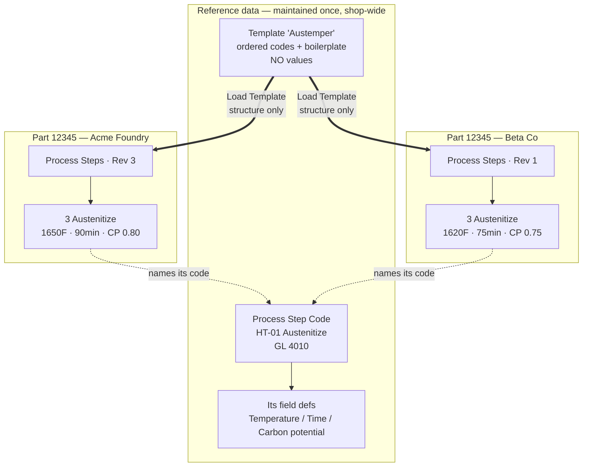
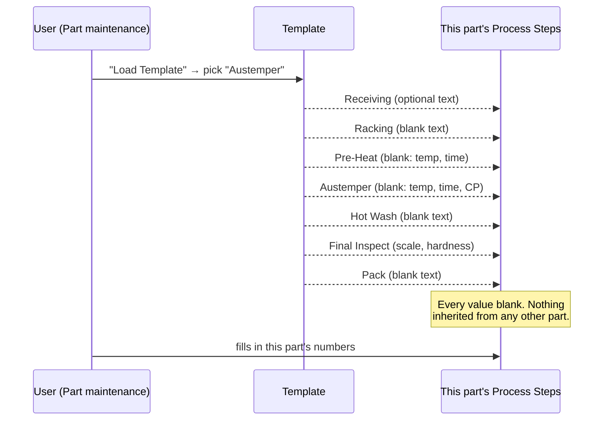
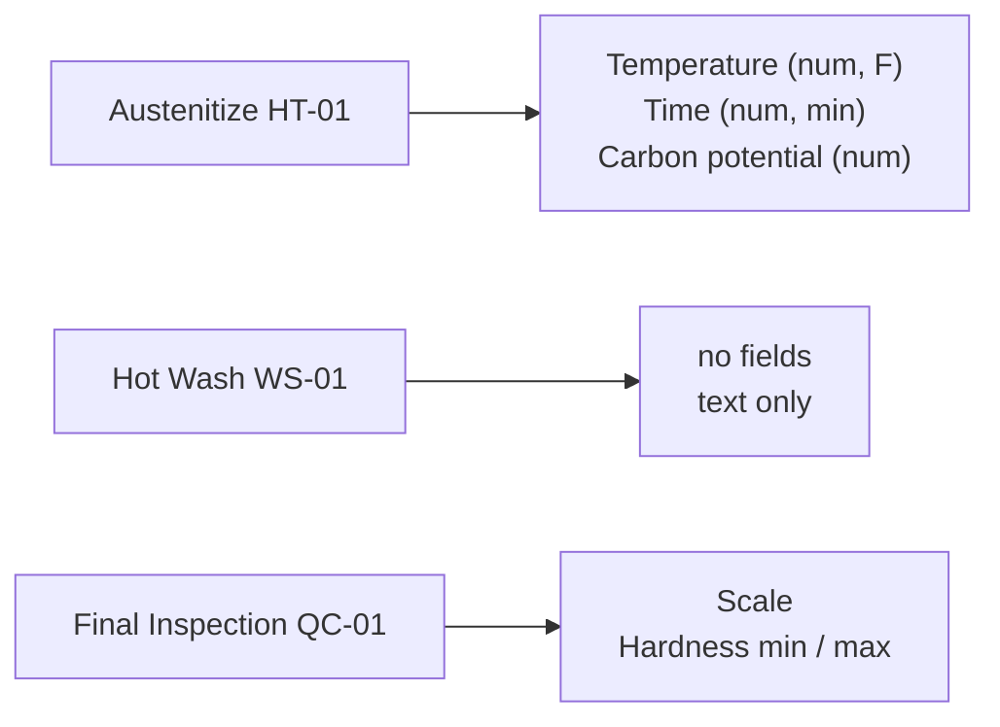
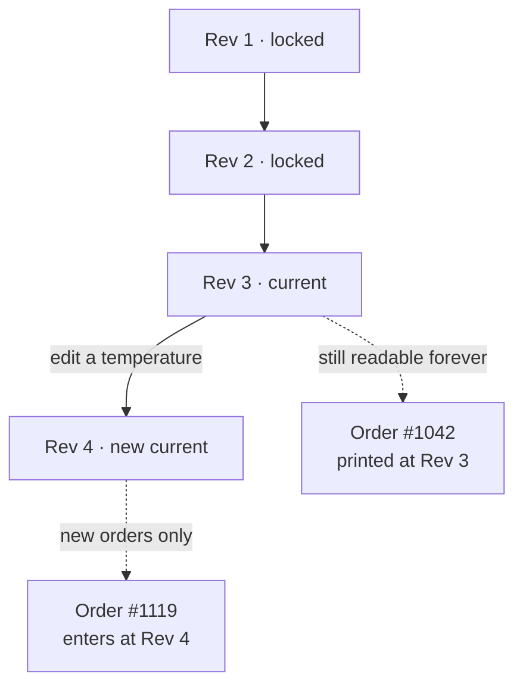

# Process Steps — the model (owner-decided 2026-07-30)

Supersedes the shared "process master" of spec §5.1. Written during Phase 2 planning.

**The change in one line:** the recipe belongs to the **part**, not to a shared master. What is shared is the *vocabulary* (Process Step Codes, which carry billing) and *blank skeletons* (Templates). No part's process can ever be affected by an edit to another part's.

---

## Vocabulary

| Term | What it is |
|---|---|
| **Process Step Code** | Shop-wide reference record — `HT-01 Austenitize`. Carries the **GL account** (this is what billing posts by, kept from Visual Shop's process codes). Defines **which fields** a step of this kind exposes. |
| **Process Steps** | A part's ordered recipe. Each step names a Process Step Code and supplies this part's values. |
| **Template** | A named, shop-built **blank** skeleton — an ordered list of step codes plus optional boilerplate text. Loads structure, never values. |
| **Revision** | An immutable snapshot of a part's Process Steps. Editing creates N+1; prior revisions stay readable forever. |

"Recipe" stays the shop's spoken word for the parameters. The application says **Process Steps**.

---

## 1. Where everything lives

Same part number, same customer-facing work, two customers, two chemistries, two independent recipes. They share only the *code* they point at — which is what makes billing consistent.

---

## 2. Loading a template

**The only copy source is a blank canvas.** There is deliberately no "copy from another part" — that path is how one customer's chemistry silently becomes another's.

---

## 3. Fields come from the step code

You configure which fields each code carries — same owner-controlled pattern as part custom fields, applied to steps. The payoff is on the traveler: a typed temperature prints in a fixed place every time and can't be quietly omitted.

---

## 4. Revisions, and what an order freezes

Orders store **part + revision number**. A traveler reprints identically years later. The Visual Shop defect — editing a shared step silently rewriting in-flight work — is now structurally impossible rather than merely prevented by a rule.

---

## What this deleted

- Shared process masters, and the master↔part indirection
- **Per-part step overrides** — an entire Phase 3 feature, no longer needed
- The live step library and its copy-on-write semantics (replaced by blank templates)

## What it costs

- **No cross-part propagation.** Changing how you austemper means editing each part. Given that outcome depends on the customer's base chemistry, this is the safe direction — but it is a real trade.
- **No enforced consistency.** Nothing stops a recipe that skips Hot Wash. Templates make the right shape the easy shape; they don't compel it.

## Open detail for the plan (not an owner question)

When exactly does a new revision get cut? Cutting one on every keystroke-save would churn during initial setup. Sensible default: amend the current revision until it has been consumed by an order, then the next edit starts N+1.
