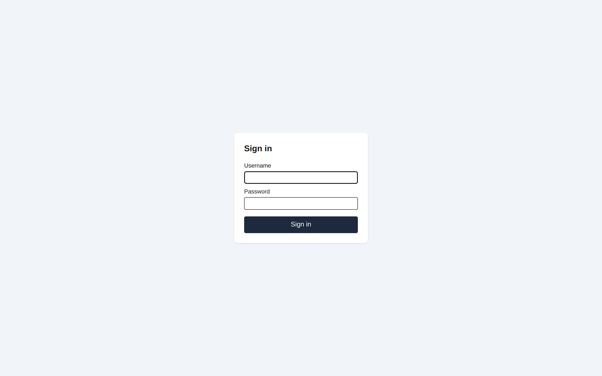

# 1. Getting around

[← Back to contents](README.md)

## Signing in

Open the address the office gives you — on the shop PC it is usually a bookmark — and you land
on the sign-in screen.

Enter your username and password and press **Sign in**. There is no "remember me" and no
self-service password reset: if you are locked out, an administrator resets you from the Users
page (chapter 12).

> **The first account.** A brand-new installation has one administrator, `admin`, with the
> password `admin`. Until that password is changed the app shows an amber banner on every
> screen saying so. Change it immediately — the banner is the app telling you the shop's books
> are currently protected by a password everyone knows.

## The screen

Every screen has the same three parts.

**The left rail** is the menu. You only see the sections you have permission to use, so your
rail may be shorter than a colleague's — that is normal, not a fault. Administration entries
are grouped under a heading at the bottom.

**The search bar** across the top searches orders, parts and customers at once. It is also the
**barcode box**: scan a traveler and the app jumps straight to that order. You do not need to
click into the box first in the usual case — scan, and the page moves.

**The right-hand corner** shows who you are signed in as, and **Sign out**.

## When something is greyed out

This is the single most useful habit in the whole application: **a disabled control always
carries its reason.** Hover it and a tooltip tells you exactly why you cannot use it.

The reason is one of a small number of things:

| What the tooltip says | What it means |
|---|---|
| "Requires *something*.edit" | You do not have that permission. An administrator can grant it. |
| "Order is voided" | The record was voided. Voided records are read-only forever. |
| "Invoice is finalized" | The paper has been raised. Correct it by unlocking or by a credit memo (chapter 6). |
| "That month is closed" | The accounting period is closed. It must be reopened before anything can post into it (chapter 8). |
| "Pick a lead part first" | The screen needs an earlier field filled in before this one can be decided. |

Controls are **disabled and visible**, never hidden. If you cannot see a button at all, that is
a different thing — it means the whole section is outside your permissions.

## Nothing is really deleted

Deleting hides a record; it never destroys it. Every create, edit and delete is recorded with
who did it, when, and the before-and-after values. Most detail screens carry a **History**
panel showing that trail, including changes made in the sub-sections of the record.

Deletes that carry consequences — deleting a customer, deleting a role — ask you for a
**reason**, and that reason is stored with the record. Routine tidying up (removing a carrier
you mistyped) does not ask, deliberately: being asked to justify every small correction trains
people to type "x".

## Two habits worth forming

**Read the warnings, they are not errors.** Several screens show amber notes — an order whose
loads no longer match its quantities, a quote that overlaps another, a shipment that exceeds
what was ordered. These do not block you. They are the app telling you something a person
should look at.

**Let the app allocate numbers.** Order numbers, shipper numbers, BOL numbers, invoice and
credit numbers are all issued by the system in sequence when the document is saved. A number is
never consumed by a save that fails, and you cannot type your own.

---

Next: [2. Orders →](02-orders.md)
