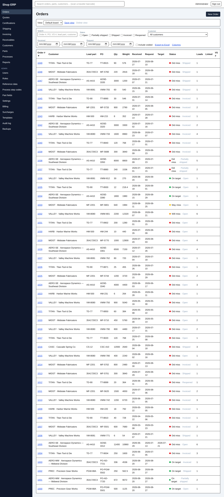
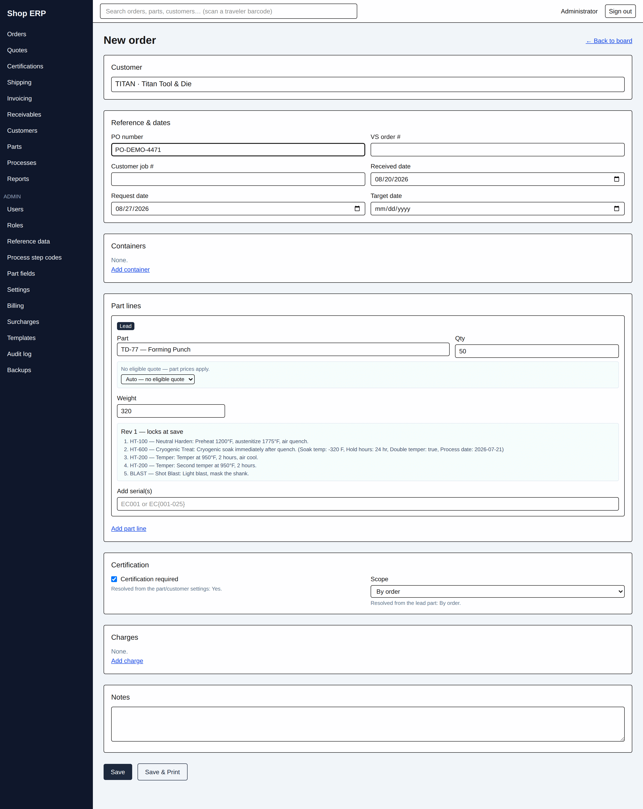

# 2. Orders

[← Back to contents](README.md)

An order is the centre of the system. Everything else — the traveler that goes to the floor,
the shipper, the certificate, the invoice — hangs off it.

## The board

The Orders screen is the shop's daily list.

Each row is an order. **Status** tells you where it is:

| Status | Meaning |
|---|---|
| Open | Nothing shipped yet |
| Partially shipped | Some lines shipped, some still out |
| Shipped | Everything shipped — the shipper's *line complete* boxes decide this, not the quantities |
| Invoiced | An invoice has been raised |
| Reopened | A shipment was reversed after invoicing, putting the order back in play |

**Voided orders are not a status.** Voiding hides the order; it stays in the system and in the
history forever. Tick **Include voided** to see them.

The coloured dot beside the status is the **traffic light** against the request date — on
target, close, or late. It is a metric, not a gate: nothing stops you shipping a late order.

### Finding work

The filters across the top narrow the board by search text, status, customer and date range.
The **search box at the very top of the screen** is different and usually faster: it searches
orders, parts and customers together, and it accepts a **scanned traveler barcode** — scan, and
the order opens.

### Saved views

Set the filters and columns the way you like them, then **Save view**. Pick a saved view from
the dropdown to return to it. Tick **Set as default** on a view and it is the one you land on
each morning.

**Columns** lets you choose which columns appear and in what order. **Export to Excel** exports
exactly what you are looking at — same filters, same columns.

## Entering an order

**New Order** opens the entry screen.

Work top to bottom, because later fields depend on earlier ones:

1. **Customer.** Everything downstream is scoped to this customer — including which parts you
   can pick. This is deliberate: **part numbers belong to a customer, not to the shop.** The
   same number can exist for two customers and mean two different parts with different recipes.
2. **Lead part** (the first line). The lead part decides the certification requirement and
   drives how the order splits into loads.
3. **Lines.** Each line needs a part, a **quantity and a weight** — both, always. Add as many
   as the order needs.
4. **PO number, dates, notes.** The request date is filled in for you from the customer's or
   part's lead time; change it if the customer asked for something else.

Some fields stay disabled until the field above them is answered — the certification control,
for instance, says *"Pick a lead part to resolve the certification requirement."* That is the
form telling you the order of operations, not a fault.

**Your work is not lost if you wander off.** Order entry keeps a draft as you type. Come back
and you are offered **Resume** or **Discard**.

When you save, the app allocates the order number, splits the loads, and — if the part or
customer calls for a certificate — creates the cert requirement automatically.

## Loads

A load is a furnace run. The order splits into loads automatically from the lead part's load
quantity and load weight: 1,000 pieces at 300 per load becomes 300 / 300 / 300 / 100.

You can edit the split by hand, and **Re-split** re-derives it from the part's current limits.
Loads must be numbered 1 to N with no gaps.

**Loads are not containers.** A load is how the work runs through the furnace; a container is
how the customer's parts are packed. They rarely line up, and shipping is not tied to load
boundaries — you can ship 230 pieces out of a 300-piece load because that is what fills the
customer's basket.

If you change quantities after a traveler has printed, the app warns you that the paper on the
floor no longer matches. It does not stop you — print a fresh traveler.

## The order hub

Opening an order gives you every part of it on one screen: the header details, the lines, the
loads, containers, serial numbers, extra charges, the documents printed against it, and the
**History** panel showing every change made to it — including changes made in its sub-sections.

### The traveler

**Print traveler** produces the shop paper, with the barcode that brings you back to this order
when scanned. You can print all loads at once or one load at a time; each load's sheets carry
their own page numbering.

Reprinting reissues the **stored** document — the exact bytes that printed the first time, not
a fresh render. That matters: the paper in the shop and the paper in the system are the same
paper.

## Voiding an order

**Void** asks for a reason and records it. A voided order is read-only forever: no new
documents, no edits. It cannot be voided at all if a finalized invoice covers it — correct that
through the invoice first (chapter 6).

---

Next: [3. Quotes →](03-quotes.md) · Previous: [1. Getting around](01-getting-around.md)
