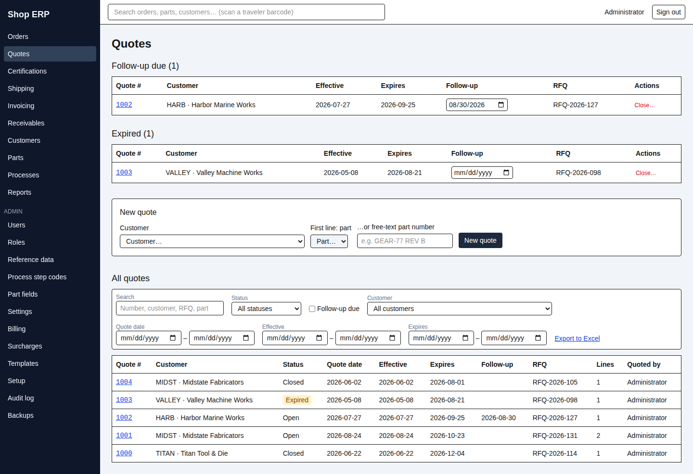
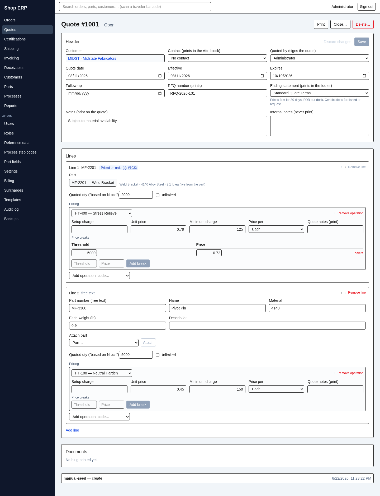

# 3. Quotes

[← Back to contents](README.md)

A quote is a **standing price agreement**: a customer, a set of their parts, the operations you
will run on them, and the prices — good between two dates. It is also the mechanism by which an
agreed price reaches the invoice, months later, without anyone re-typing it.

## The quotes screen

Three things stacked, top to bottom:

**Follow-up due** and **Expired** are the worklists — the quotes that want a phone call today.
Each row carries a **Follow-up** date box you can change in place (that is the "bump it a week"
action) and a **Close…** button. A quote can appear in both lists at once; that is information,
not a fault.

**New quote** starts one. **All quotes** below is the full searchable list, with an **Export to
Excel** that exports exactly what the filters are showing.

## Open, Closed — and Expired

A quote's status is only ever one of two things:

| Status | Meaning |
|---|---|
| Open | Live. It prices new orders inside its date window. |
| Closed | Deliberately ended. Orders already linked to it keep their prices; it prices no new ones. |

**Expired is not a status.** It is *derived*: an Open quote whose **Expires** date has gone by
reads as Expired — on the list, in the worklist, on the quote itself, and in the Excel export.
Nothing flips it, no job runs overnight, and moving the expiry date forward makes it read Open
again immediately. The status filter offers **Expired (derived)** as a third choice for exactly
this reason. A quote expiring *today* is not expired; it still has today.

There is likewise no "won" or "lost" status. **Won or lost is the reason you type when you
close it** — free text, kept with the quote and in its history.

## Starting a quote

The **New quote** box needs two things: a **Customer**, and a first line — either a memorized
part, or a **free-text part number** for work on something not in the catalogue. It is one or
the other; picking a part greys out the free-text box and vice versa, and the tooltip says so.

Everything else — the quote number, the quote/effective/expiry dates, who quoted it, the
default ending statement — is filled in for you and is visible on the quote's own page, where
the app lands you.

If the new quote overlaps an open quote already covering the same part, you get an amber note
and a **Go to quote** / **Stay on this page** choice rather than being hurried past it:

> Part P-100 is also quoted on open quote #1007 (effective 2026-01-01 – 2026-12-31, overlapping
> this quote's window) — at order entry, the latest effective date wins

The overlap is a warning, never a refusal — two live quotes for one part is a real situation,
and the note tells you which one will actually be used. The same warning appears on any later
save that creates an overlap.

## The quote page

This page is a **single-save form**, unlike most of the app: you edit the header and the lines
freely, an **Unsaved changes** flag appears, and one **Save** writes the lot. **Discard
changes** throws the edits away. Actions that reload the quote — Close, Reopen, Attach part —
are greyed out while you have unsaved changes, with the tooltip *"Save or discard your changes
first"*.

**The header** carries the dates, the contact that prints in the Attn block, who signs it, the
RFQ number, the ending statement that prints in the footer, and two note boxes: **Notes (print
on the quote)** and **Internal notes (never print)**. The customer cannot be changed — that
tooltip too says so: delete the quote and enter a new one.

### Lines and pricing

Each line is a part — memorized or free text — with:

- **Quoted qty ("based on N pcs")**, or the **Unlimited** tick. This is informational; the real
  quantity brackets are the price breaks.
- **Pricing**: one row per operation, each naming a step code and carrying **Setup charge**,
  **Unit price**, **Minimum charge**, **Price per**, and **Quote notes (print)**. Under each,
  **Price breaks** — a threshold and a price, as many as the deal needs.

A line with no priced operations is legal, and the page says what it means: *"No priced
operations yet — an empty agreement invoices as needs-price, never part prices."* That is worth
reading twice. An empty quote line does not fall back to the part's own price list; it produces
an invoice line flagged **needs price** for a human to fill in.

A free-text line can be promoted later with **Attach part**: pick the memorized part, press
**Attach**, and from then on the line links to the catalogue. Do this before you expect the
quote to price an order — **a free-text line can never be linked to an order line.**

Two rules the form enforces by name: a part can appear on a quote only once (*"that part is
already quoted on this quote"*), and a line is either quoted for a quantity or Unlimited, never
both. Effective must be on or before Expires. An **inactive** part is deliberately still
allowed — going inactive hides a part from pick lists, it does not tear up an agreement.

> **Changing "Price per" on a row that has breaks does not convert anything.** The app asks you
> to confirm, and tells you plainly: every stored number — the unit price and every break's
> threshold and price — will simply be *read* as the new unit from now on. Nothing is
> recalculated.

## How a quote reaches an order — and the invoice

This is the point of the whole chapter. On **order entry**, each line shows a small **Quote
link** panel:

| What it shows | What it means |
|---|---|
| "Quote link (auto): Quote #1006 (effective … to …)" | The app found one open, in-date quote for this customer and part and will use it |
| "No eligible quote — part prices apply." | Nothing covers it; the part's own price list will price the line |
| "Quote link (picked): Quote #…" | You overrode the automatic choice |
| "No quote (explicit) — part prices apply." | You deliberately turned the link off |

The dropdown offers **Auto**, each eligible quote by number and window, and **No quote**.
Swapping the line's part resets the pick back to Auto.

A quote is eligible when it is **Open and live**, its line **carries a real part** (not free
text), it belongs to the **same customer**, and the order's **received date falls inside the
effective-to-expiry window** — inclusive at both ends. Where several qualify, the one with the
**latest effective date wins**, and a tie goes to the higher quote number.

**Eligibility is judged against the order's received date**, not today's — so back-dating an
order can change which quote covers it. If you pick a quote and then move the date out of its
window, the panel warns *"The picked quote line is not eligible as of this received date — Save
will refuse it."* A refused save says exactly which clause failed, for example:

> Line 2 (ACME · P-100): Quote #1006 is not in effect on 2026-08-19 (effective 2026-01-01 to
> 2026-06-30)

Once saved, **the link is stored on the order line and stays there.** Closing the quote later
does not unpick it — which is exactly why closing shows you a warning (below). Editing something
else on the line, a quantity say, never silently re-resolves it onto a newer quote.

> **A linked line is priced by the quote and by nothing else.** The part's own price list is not
> consulted, not merged in, and not used as a fallback — even for operations the quote never
> priced. That is the whole value of the link, and the reason an empty quote line invoices as
> *needs price*. On the invoice, a line priced this way names its source: **Quote #1006**,
> frozen onto the invoice line and still readable long after the quote itself is gone.

A part's own page carries an **Active quotes** section — *"No open quote covers this part
today"* when there is none — which is the fastest way to answer "are we still quoted on this?"

## Closing and reopening

**Close…** asks for a reason, and the reason is required. The dialog states the deal plainly:
closing stops the quote pricing *new* orders, orders already linked keep their pricing, and
closing is reversible.

If open orders still price from the quote, closing succeeds and then tells you so, listing them
by number:

> Quote #1002 is closed, but 2 open order(s) still price from it and are not yet fully invoiced.
> Their stored links keep pricing them.

That is not an error and there is nothing to fix. It is the app making sure you know that
closing a quote does not retroactively re-price work already booked against it.

**Reopen…** also asks for a reason, and puts the quote back to being a standing agreement in
its window. The close reason is cleared by reopening — the whole story stays in the History
panel.

**A closed quote cannot be edited.** Every field greys out with *"This quote is closed — reopen
it before editing"*. Reopen, edit, close again.

## What a linked order locks

While a live order prices from a quote line, that line is partly frozen. The line card says so
up front, and a save that tries anyway is refused by name:

| You try to | What happens |
|---|---|
| Remove the line | Refused: *"Line 1 (P-100) cannot be removed — order(s) #1042, #1051 still price from it"* |
| Change its part | Refused: *"…its part cannot be changed — order(s) #1042 still price from it"* |
| **Change its prices** | **Allowed** — and it re-prices those orders until they are invoiced |

That last row is not a bug. A quote stays live right up until the invoice is finalized, so
correcting a price on a quote is how you correct work already booked against it.

## Deleting a quote

**Delete…** needs a reason. If any live order line still points at the quote, the delete is
refused — *"This quote cannot be deleted — order(s) #1042 · ACME still price from it"* — and you
get a panel listing the blocking orders with links, an **Export to Excel** of that list, and the
note: *"Unlinking is an order-side edit: re-pick or unlink the quote on each order's line, or
invoice the orders through — then the delete goes through."* The quote number is never reused.

## Printing

**Print** produces the quote document and archives it under **Documents** on the same page. A
closed or expired quote still prints — it is the record of an agreement that existed. Only a
deleted quote refuses.

> **A quote prints live, an invoice prints frozen.** Reprinting a quote re-reads today's part
> names, today's contact, today's address — unlike an invoice, which is fixed the moment it is
> raised (chapter 6). Two prints of the same quote a month apart can legitimately differ. Its
> **Internal notes** never appear on either.

---

Next: [4. Shipping →](04-shipping.md) · Previous: [2. Orders](02-orders.md)
