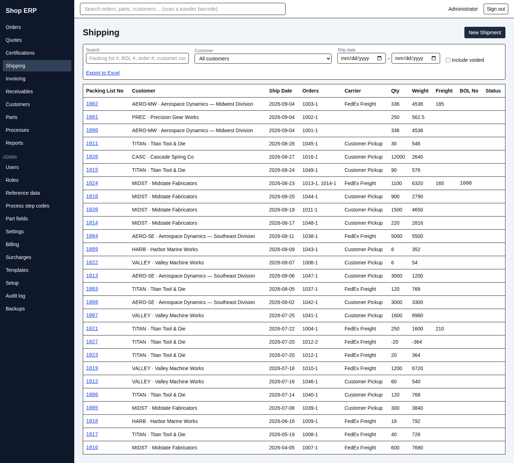
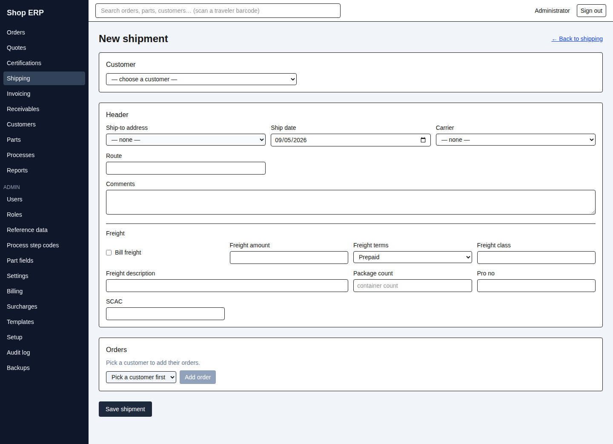
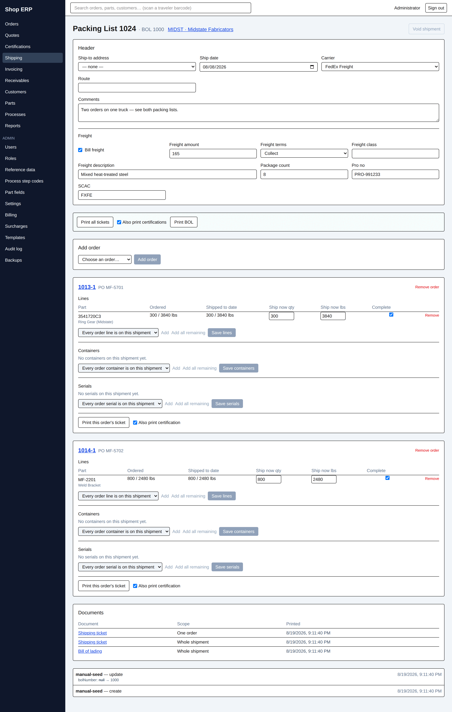

# 4. Shipping

[← Back to contents](README.md)

A shipment is the paper that goes out with the truck: the **packing list** (the shipping ticket),
and — when the carrier wants one — the **bill of lading**. One shipment can cover several orders
for the same customer, which is why the app calls the document a Packing List rather than an
"order shipment".

## The shipping list

| Column | What it is |
|---|---|
| Packing List No | The shipment's own number. Click it to open the shipment. |
| Orders | Every order on it, as `order-sequence` — `1031-1` is order 1031's first shipment |
| Qty / Weight | The totals across every order on the shipment |
| BOL No | Blank until a bill of lading has been printed |
| Status | Blank normally; **voided** on a withdrawn shipment |

The search box takes a **packing list number, BOL number, order number or customer code**.
Voided shipments are hidden until you tick **Include voided**.

## Building a shipment

**New Shipment** opens a blank one. It is a single form with a single **Save shipment** at the
bottom: nothing is written, and no number is used up, until you press it. There is no draft
autosave here (unlike order entry) — walking away from a half-typed shipment loses the typing
and nothing else.

Work top to bottom:

1. **Customer.** Everything below is scoped to them. Changing the customer clears the orders you
   had added, the ship-to address and any override reason — deliberately, because none of it
   belongs to the new customer.
2. **Header** — ship-to address, ship date (today, unless you change it), carrier, route,
   comments.
3. **Freight** — Bill freight, amount, terms (**Prepaid** or **Collect**), class, description,
   **Package count**, Pro no and SCAC. Leaving Package count blank uses the current container
   count, and the field says so.
4. **Orders.** The picker offers only that customer's orders with something left to ship. **Add
   order** brings the order in as its own panel; add as many as are going on the same truck.

If the customer is on **credit hold** you are told before you waste any typing — named, and
linked to their record. With the `override_credit_hold` action you get a required reason field;
without it, **Save shipment** is disabled and the tooltip says which action you are missing.

### Lines, containers and serials

Each order gets three grids.

**Lines** is the one that matters:

| Column | |
|---|---|
| Ordered | Qty and lbs on the order |
| Shipped to date | What earlier shipments already took |
| Ship now qty / Ship now lbs | What is going today — **prefilled to what is left**, and freely editable |
| Complete | The line-complete tick — see below |

The prefill is a suggestion, not a ceiling. You can ship more than remains; the app warns and
lets you through. **Add all remaining** fills every unshipped line in one click.

**Containers** is which of the order's container rows travelled, and how many. **Serials** is
which serial numbers went, each with a **Print on ticket** tick.

> **The *Complete* tick is what closes an order, not the numbers.** An order becomes **Shipped**
> when every one of its lines sits on a live shipment with *Complete* ticked. Until then it is
> **Partially shipped**, however the quantities look. This is deliberate: only a person can say
> "that's the lot" — a short shipment against an over-run, a customer who accepted 98 of 100, a
> line that will never be finished. Ship the full quantity and leave *Complete* unticked and the
> order stays Partially shipped, and will not appear in **Ready to invoice**.

When you save, you may get an amber list. None of it blocks the save:

| Warning | What it is telling you |
|---|---|
| "…shipping 40 / 80 lbs exceeds the remaining 30 / 60 lbs on this line" | You are shipping more than was left |
| "…shipped-to-date 120 / 240 lbs exceeds the 100 / 200 lbs ordered" | The same fact, seen later on the shipment page |
| "Order #1031 requires a certification and none exists yet" | The order needs a cert nobody has made |
| "…requires serialization but no serial numbers were selected for this shipment" | The part is serialized and this shipment names no serials |
| "Serial 4471 also appears on Packing List 1019 (2026-07-14)" | The same serial has gone out twice |

## The shipment page

The header fields save as you leave each one — there is no Save button up here. Below the
header sits the print bar, then one panel per order, each with its own **Save lines** /
**Save containers** / **Save serials** buttons, then **Documents** and **History**.

**Add order** adds another order to an existing shipment. It must be the same customer —
otherwise you get *"Order #1042 does not belong to the same customer as this shipment"* — and it
cannot already be on it.

**Remove order** on a panel takes one off, and warns that the lines, containers and serials for
that order go with it. It is refused in two situations worth knowing, both pointing at the same
answer:

- *"This is the only order on the shipment — void the shipment (Packing List 1031) instead of
  removing its last order."*
- *"Shipment paper covering this order has already printed (Packing List 1031) — void the
  shipment instead of removing it."*

Once a ticket exists, in other words, the order stays on the paper. Void and start again.

Rows can appear in a grey dashed strip reading *"kept from earlier selections (the order-side
rows were since corrected away)"*. Those are lines, containers or serials that were on this
shipment when somebody later corrected the order. They stay on the paper — they were printed —
but they are read-only. Nothing is wrong.

### When an invoice has already been finalized

A finalized invoice freezes the money side of the shipment. You will still be able to fix the
route, the comments, the ship-to, the carrier, the PRO number and the SCAC — descriptive
corrections are always allowed — but changing the **freight**, adding an order, removing one, or
replacing the lines is refused:

> This shipment cannot be changed — Invoice 1031 is finalized; unlock it or raise a credit

Containers and serials are deliberately *not* frozen; they carry no money.

### Printing

| Button | Produces |
|---|---|
| Print all tickets | One shipping ticket sheet per order on the shipment |
| Also print certifications | Ticked by default — each covered order's certificate prints and is archived alongside |
| Print BOL | The bill of lading for the whole shipment |

A single order's ticket prints from that order's own panel.

**The BOL number is issued on the first BOL print and never again.** Print it a second time and
the same number comes back on the same paper — the reprint hands you the stored document, byte
for byte, not a fresh render. There is no way to type a BOL number yourself, and a shipment that
never had a BOL printed simply has none.

If your browser blocks the new tab, the print still happened: the page says so and the document
is waiting under **Documents**.

## Voiding a shipment

**Void shipment** asks for a reason and records it. The dialog is explicit: every control
becomes read-only, the stored documents stay reprintable forever, the packing-list number and
each order's shipment sequence are never reused, and it cannot be undone from the screens.

Voiding is not part of ordinary shipping permission — it takes the named **`void_shipper`**
action, which the shop grants to a shorter list of people. Any shipment-scope certificate
hanging off the shipment is voided with it, carrying the same reason (chapter 5).

Void is refused, with the button greyed out and the reason in its tooltip, when:

| Tooltip | What to do |
|---|---|
| "Already voided" | Nothing — it is done |
| "This shipment cannot be voided — Invoice 1031 is finalized; unlock it or raise a credit" | Deal with the invoice first (chapter 6) |
| "This shipment has been reversed by Packing List 1027 — void the reversal first" | Void the reversal, then the original |

## Reversals

A **reversal** is the correction for a shipment you cannot simply void — typically because the
order has already been invoiced and finalized. Rather than erase anything, it creates a **second,
paired document**: its own packing list number, its own shipment sequence on each order, and the
original's lines with **negative quantities**. Both pieces of paper stay readable, which is the
whole point — the customer has the first one.

Reversing also:

- clears the *Complete* ticks the original set, so the order drops back to Partially shipped; and
- puts any order carrying a **finalized invoice** into **Reopened** — the one place that status
  ever comes from.

**Once a reversal exists, the pair is frozen.** Every editing control on both documents is
disabled, with a banner at the top of the page saying which:

> This is a reversal of Packing List 1024 — a reversal is machine-generated mirror paper; void it
> and re-reverse instead of editing it

> This shipment has been reversed by Packing List 1027 — void the reversal first, then edit, then
> re-reverse

That second sentence is the correction cycle, spelled out: **void the reversal, edit the
original, reverse again.** Voiding a reversal is the blessed undo and stays enabled on the
reversal itself; the original's own Void does not.

A shipment can only be reversed once while the reversal is live, a reversal cannot itself be
reversed, and a reversal that would drive a line's shipped-to-date below zero is refused by name.

> **There is no Reverse button on any screen in this build.** Reversals exist, are visible, and
> behave exactly as above — the demonstration data contains one, on order 1013 — but nothing in
> the shipping screens raises a new one. If a shipment needs reversing, that is a call to whoever
> administers the system, not something the shipping desk can do today.

---

Next: [5. Certifications →](05-certifications.md) · Previous: [3. Quotes](03-quotes.md)
