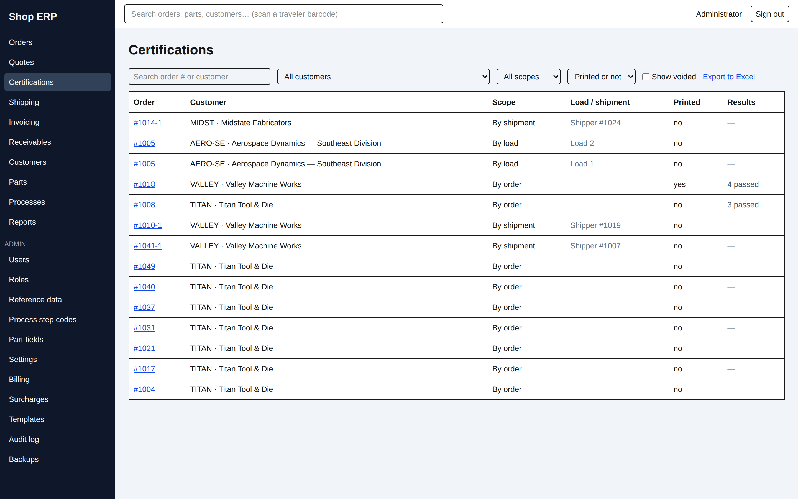
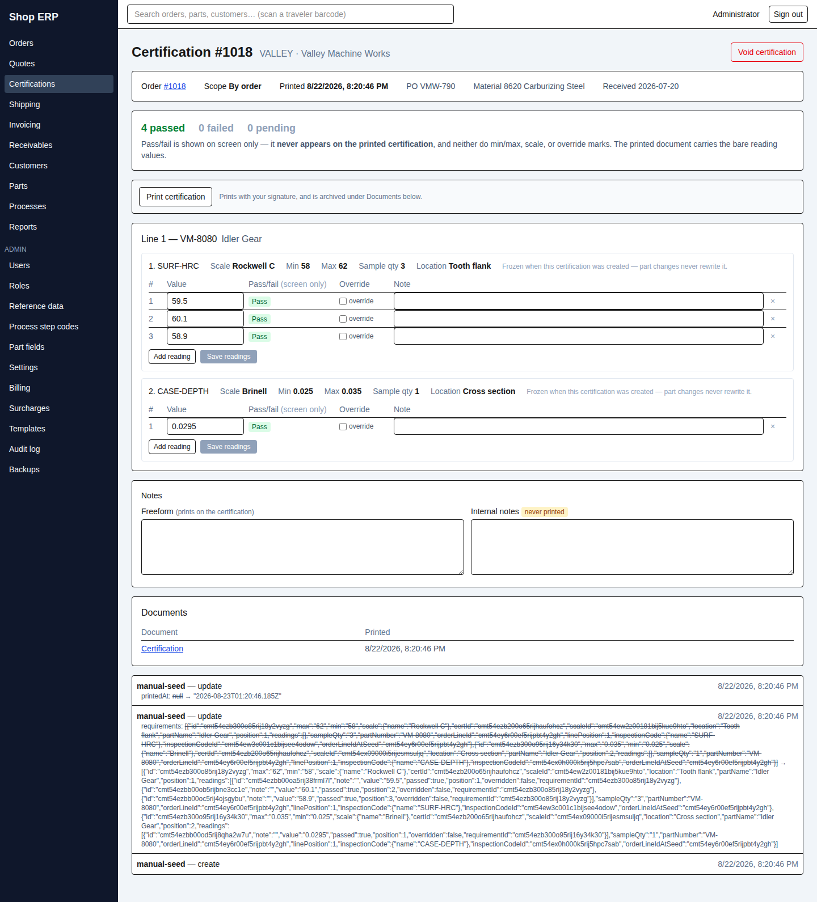

# 5. Certifications

[← Back to contents](README.md)

A certification is the piece of paper that says what you measured. It hangs off an order, it
carries readings taken against requirements copied from the part, and once it is printed it is
the shop's word on that heat treat.

## A cert has no number and no status column

Two things about certifications surprise people who know the rest of the app.

**A cert has no number of its own.** It is labelled by its order — `#1018` — and for a cert
tied to one shipment, by that order's shipment sequence too: `#1018-2`. There is no cert number
series, and nothing to quote to a customer except the order.

**A cert has no status column either.** Where it stands is worked out from the facts:

| State | How it is worked out | What you see |
|---|---|---|
| Pending | Requirements exist, no readings entered | Results column shows "4 pending" |
| Results entered | Some readings have values | "3 passed, 1 pending", or "1 of 4 failed" in red |
| Printed | It has been printed at least once | Printed column reads "yes", with the date and time on the cert |
| Voided | It was voided | Dimmed row, **voided** tag, red banner with the reason |

Those are not exclusive — a cert can be printed *and* still have pending readings. Note the
three-way count: a reading nobody has entered is **pending**, never a pass.

## The certifications list

Filter by customer, by scope, by printed or not, and tick **Show voided** to include withdrawn
ones. The **Order** column is the link into the cert.

## Where certifications come from

Whether an order needs a cert, and at which **scope**, is decided when the order is saved and
frozen onto the order from then on. There are three scopes:

| Scope | Shown as | One cert per | Created |
|---|---|---|---|
| ORDER | By order | The whole order | Automatically, when the order is saved |
| SHIPMENT | By shipment | Each shipment of the order | Automatically, when the shipment is saved |
| LOAD | By load | Each furnace load | By hand, from the order |

Order-scope and shipment-scope certificates normally appear on their own; load-scope ones are
always made by hand. All three can be raised by hand when something is missing — see **Raising one
yourself**, below.

The order's **Certifications** section is where all of that happens. It shows the load gap plainly —

> by load · 4 loads · 2 certs

— with a **Create cert for Load 3** button for each load that has none. That line exists so
lazy creation is never quiet forgetting.

If the loads are re-split after a cert was made, a cert can end up pointing at a load number
that no longer exists. The section flags it rather than tidying it away:

> Certification for Load 4 points at a load that no longer exists after a re-split — void it or
> re-create it for a current load.

An order can only hold one live cert per scope instance; a second attempt is refused with *"This
order already has a certification for that scope."*

### Raising one yourself

Automatic creation covers the ordinary case, but it is not the only way a cert can be missing — one
can be voided and need re-raising, or an order's requirement can be set after the fact. So the
Certifications section carries **Raise a certification**: pick the scope, press the button.

The picker offers **By order**, one **By load** entry per load, and one **By shipment** entry per
live shipment of this order. Shipment entries need permission to view shipments — if you do not
have it, the picker says so rather than quietly listing fewer choices.

**It does not pre-check whether a cert already exists.** That question is settled by the server, at
the moment of writing, under a lock — so the screen deliberately does not guess. Press the button
and if one is already there you are told, and told *which*:

> A live certification already covers this order. · Load 3. · Shipper #1042.

with a link straight to it. The point is that "already done" and "cannot be done" look different.

The control appears on every order, including ones whose section reads *"None — this order does not
require a certification."* That is deliberate: the whole reason it exists is for the case where
automatic creation did not happen, and that includes an order whose requirement was set late.

> **A cert raised on a reversal shipment will print negative quantities.** A reversal is mirror
> paper, and its shipment entry currently looks like any other in the picker. Whether the app should
> label those or refuse them outright is
> [#183](https://github.com/CoJoA13/HeatSynQ/issues/183) — until it is settled, check the packing
> list number against the shipment list if an order has a reversal on it.

## Requirements come from the part

When a cert is created, the app copies one requirement for each **live inspection** on each of
the order's parts — the inspection code, the scale, the min and max, the sample quantity and
the location — in the parts' own order. Those copies are **frozen**, and the requirement block
says so: *"Frozen when this certification was created — part changes never rewrite it."*
Changing a part's inspections next month never alters a cert already being filled in.

> **A part with no inspections yields a cert with nothing to enter.** This is not a fault and
> not an empty screen by accident — the cert exists, it will print, and it simply carries no
> readings. The page says: *"No requirements were seeded for this certification — none of its
> order's parts had live inspection requirements when it was created."* If that is wrong, the
> fix is on the **part**, and it only affects certs made afterwards.

A line added to the order later brings its own inspections into every live cert on that order,
appended at the end.

## Entering results

Each requirement is a block: the frozen specification across the top, then a readings table.

| Column | |
|---|---|
| Value | The measurement. Up to six digits and four decimal places |
| Pass/fail (screen only) | Worked out live against the frozen min and max as you type |
| Override | Tick to set the verdict by hand instead |
| Note | Free text against that reading |

**Add reading** adds a row, the **×** removes one, and **Save readings** saves *that block*.
Blocks save independently — saving one never disturbs unsaved work in another.

An override needs both halves: a measurement value and an explicit Pass or Fail. *"An override
needs a measurement value"* and *"pick Pass or Fail for the override — an overridden reading
cannot stay pending"* are the two refusals you will meet, and they name the row.

> **None of the judgement prints.** The banner at the top of the page states it: pass/fail
> "never appears on the printed certification", and neither do min/max, the scale, or the
> override marks. **The printed document carries the bare reading values.** Everything on this
> screen that grades the numbers is for you, not the customer.

## Notes

Two boxes at the bottom, and the difference matters: **Freeform** *(prints on the
certification)*, and **Internal notes**, tagged **never printed**.

## Printing

**Print certification** renders it, archives it under **Documents**, and — on the first print
only — stamps the printed date.

**The signature is yours.** There is no signer to choose: the certificate prints the signature
of whoever pressed the button, above their name, title and company. If you have no signature
image on file the document still prints, with your typed name over the signature rule instead.
Signatures are uploaded per user by an administrator (chapter 12).

Certificates can also be printed from the shipment: the **Also print certifications** box on the
shipping page is ticked by default and each covered order's certificate prints and is archived
as its own document alongside the tickets. If one fails there, the tickets still print and you
are told: *"…its certification could not be printed … print it from the certification screen."*

Reprints hand back the **stored document** — the exact paper that printed the first time.

## Changing results after printing

Once a cert has printed, the readings grid locks. Reopening it takes a **named permission**, not
just the usual edit right, and the tooltip says which:

> This certification has been printed — editing results requires edit_cert_results_after_print

Without it you get *"This certification has already been printed"* and nothing changes. The
shop should be deliberate about who holds that action: it is the ability to alter a measurement
the customer already has on paper.

## Voiding

**Void certification** needs a reason. Everything becomes read-only, the stored prints stay
reprintable forever, new prints are refused, and it cannot be undone from the screens.

Certificates are also voided *for* you in two situations, carrying the reason across:

- voiding a shipment voids its shipment-scope certificates with the same reason;
- removing an order from a shipment voids that order's shipment-scope certificate, recorded as
  *"Order removed from shipment (Packing List 1024)."*

A voided cert stays visible on the order and, with **Show voided** ticked, on the list.

> **Certificates are raised from the order, never from this screen.** This list is for finding and
> reading them. If an order has no cert and you think it should, go to the order — its
> Certifications section carries both the automatic ones and **Raise a certification** for the
> cases automatic creation did not cover.

---

Next: [6. Invoicing →](06-invoicing.md) · Previous: [4. Shipping](04-shipping.md)
