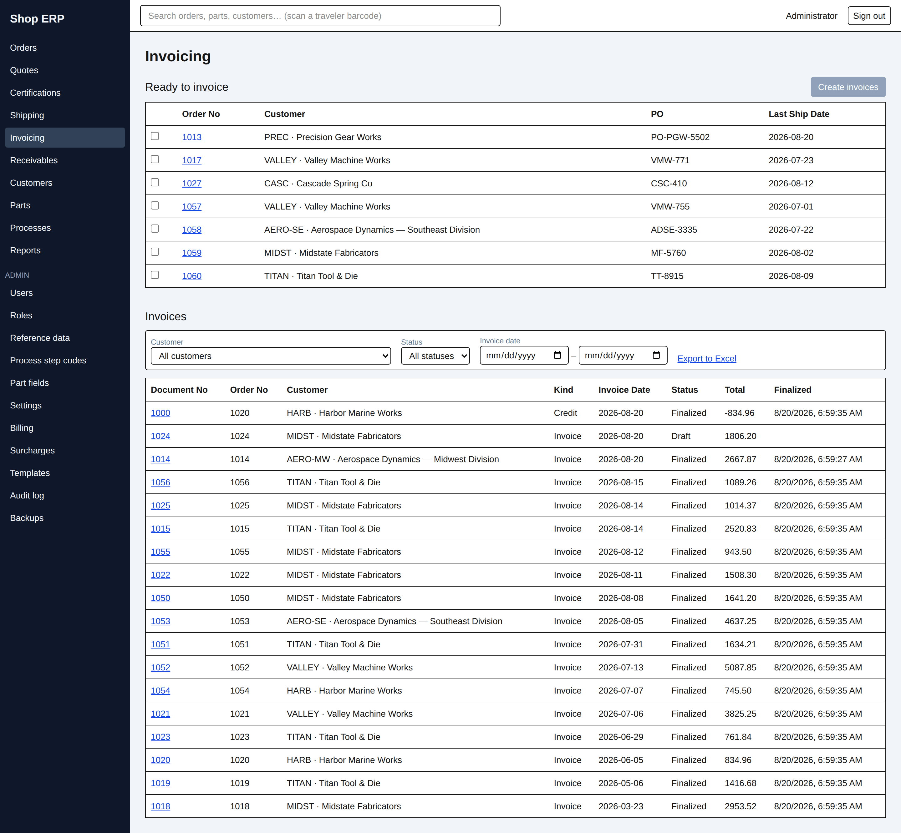
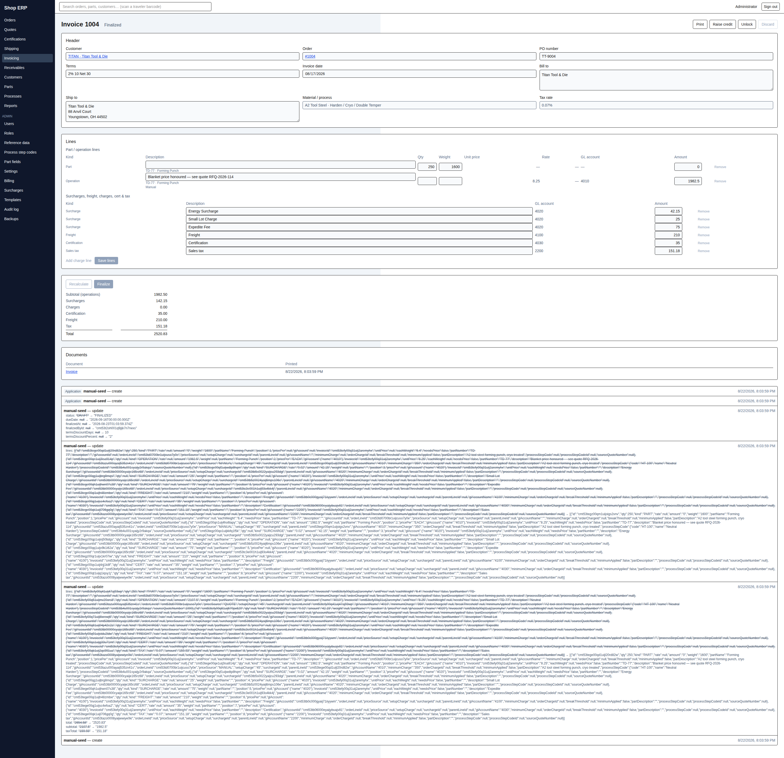

# 6. Invoicing

[← Back to contents](README.md)

Invoicing turns a finished order into paper the customer owes money against. It has two states —
**Draft**, where everything can be corrected, and **Finalized**, where nothing can — and the
whole chapter is really about that line.

## The invoicing screen

**Ready to invoice** at the top lists orders waiting: an order at **Shipped**, not voided, with
no live invoice against it. Tick the ones you want and press **Create invoices**. Each is
created on its own — if one fails, the others still go through and the failure is reported
beside that order's own row.

You pick nothing but the order. The customer, PO number, terms, bill-to and ship-to addresses,
material, process names, tax rate and every line are worked out for you.

**Invoices** below is the full list, filtered by customer, status and invoice date, with
**Export to Excel**. The **Document No** column is an invoice's order number (with the shop's
prefix, if one is set) or, for a credit, its own credit number.

> **An order must be fully Shipped.** *"Only a fully shipped order can be invoiced"* is the
> refusal, and Shipped means every line has its **Complete** tick on a shipment (chapter 4) —
> not that the quantities add up. An order that shipped in full but never got its ticks will
> never appear in **Ready to invoice**.

## What the lines are

An invoice builds itself out of seven kinds of line:

| Kind | Where it comes from |
|---|---|
| **Part** | One per order line that actually shipped. It is a heading — it always carries **$0**; its operations hold the money |
| **Operation** | One per priced operation on the part, or on the linked quote line, sitting under its Part line |
| **Surcharge** | The plant's surcharges, after the customer's opt-outs and rate overrides |
| **Freight** | One line, summing the freight from every live shipment on the order marked *Bill freight* |
| **Charge** | One per extra charge keyed on the order |
| **Certification** | One line, when the order requires a cert and the part and customer say to bill for it |
| **Sales tax** | One line, when the customer is taxable. **Freight is not taxed** |

A line the app cannot price gets a **needs price** flag and an amber row — an operation with no
price list, or a charge with no amount. A part line that shipped nothing at all is simply left
off.

## The invoice page

The header saves field by field as you leave each box. The line grid is split in two —
**Part / operation lines**, then **Surcharges, freight, charges, cert & tax** — but it is one
grid: **Save lines** writes the whole set at once.

Every operation line names where its price came from, under the description: **Part price**,
**Manual**, or **Quote #1006**.

### Manual lines replace, they do not add

Type into a line's **Amount** and that line becomes **Manual**. That single edit is the pricing
decision — it also clears the *needs price* flag. Editing a description, quantity or weight does
not reclassify anything; those are corrections.

**Add charge line** adds a row of your own, always of kind Charge.

> **A manual line is an override, not an extra.** When you press **Recalculate**, every computed
> line is rebuilt from current data — but a manual line is matched to the computed line it
> stands for and **takes that line's place**, in the same position. It does not appear beside a
> freshly regenerated twin, which would bill the customer twice. A manual line matching nothing
> at all rides at the end of the invoice, where you can see it.

If you typed a price into a **Needs price** line — one with no operation code of its own — the
app treats it as standing for the whole part line, and says so on every load:

> Line 4 · TD-77 — Needs price is a typed price standing in for every priced operation on this
> part — re-check it after any pricing change

That warning is worth acting on. It means that if a real price list appears for that part later,
your typed figure is what will be billed instead of it.

There is no "revert to computed" button, by design. Remove the row, save, and recalculate — the
computed line comes back.

### Save lines vs Recalculate

| | Save lines | Recalculate |
|---|---|---|
| The lines | Writes exactly what is in the grid, amounts as typed | Rebuilds every computed line from **current** prices, surcharges and shipped totals; manual lines survive and take their slots |
| The tax | Recomputed over what you just saved | Recomputed over the final set |
| A manually typed tax line | Left exactly as typed | Left exactly as typed |

Both need the price-changing permission on top of ordinary edit rights, and both are refused on
a finalized invoice: *"Invoice #1031 is finalized and locked — unlock it before editing."* A
credit cannot be recalculated at all.

## Finalizing

**Finalize** raises the paper. Afterwards every editing control is locked, the order moves to
**Invoiced**, and the invoice starts ageing.

It refuses in three ways worth knowing:

| Refusal | Meaning |
|---|---|
| "That invoice has no lines — add the work being billed, or discard it" | An invoice with nothing on it is not paper |
| "Line 3 · TD-77 — Nitride needs a price — price every line before finalizing" | Something is still flagged *needs price* |
| "The accounting period 2026-07 is closed — reopen it to make this change" | The month you are finalizing into is shut (chapter 8) |

> **It refuses an empty invoice, never a zero total.** A warranty job, a no-charge rework, a
> goodwill re-run — all of these are real paper, listing the work at $0, and the app will
> finalize them happily. What it will not do is let an order sit at Invoiced behind a document
> with nothing on it.

A missing GL account does **not** block finalizing. It shows as a warning — *"Line 6 · Freight
has no GL account"* — and becomes a blocker later, at the month-end export (chapter 8).

The month that counts is the month you **finalize in**, not the invoice date. An invoice dated
in July but finalized in August belongs to August.

### What finalizing freezes

> **A finalized invoice is frozen paper.** Names, addresses, part numbers, GL account names and
> every price on it are **snapshots**, taken when the invoice was raised and read back
> unconditionally forever. Rename the part, retire the price, move the customer to a new
> address, delete the quote it was priced from — none of it rewrites an invoice already in the
> customer's hands. This is the opposite of how the shipping and certification screens behave,
> and it is deliberate: those documents are still being worked on, an invoice is not.

Finalizing additionally stamps three things that until that moment were being read live off the
customer:

- the **due date**, from the invoice date plus the terms' net days;
- the **early-pay discount** — the percent and the days — so that reassigning a customer's terms
  next month cannot change what an invoice already issued is worth (either way);
- the **terms name**, re-stamped from the customer's actual terms record.

That last one has a sharp edge: **if the customer has no terms record, a terms label you typed
by hand on the draft is cleared when you finalize.** If terms matter on that invoice, set them
on the customer, not on the invoice.

## Unlocking

**Unlock** puts a finalized invoice back to Draft. It needs a reason, and it needs the named
**`unlock_invoice`** action — no amount of ordinary invoicing permission substitutes.

Everything unlocks: the header, the lines, Recalculate, and Discard. The order goes back to the
status its shipments say it should have. Unlock works even after the invoice has printed — the
printed copy stays exactly as printed.

Two things stop it:

- *"Invoice #1031 has payments, credits or write-offs applied — void them before unlocking"* —
  money has already landed against it (chapter 7);
- the period lock, guarding **the month it was finalized in**, not the invoice date. Unlocking a
  July-finalized invoice in August needs July reopened.

## Credit memos

**Raise credit** on a finalized invoice creates a credit memo and takes you straight to it.

| | |
|---|---|
| Numbering | Its **own series** — a credit prints its bare credit number, not the order number |
| Lines | Every line of the source invoice, copied with the money **sign flipped**, everything else as billed |
| Date | **Today**, the day you raise it — never the source invoice's date |
| Order status | A credit does not touch it |

An invoice can be credited more than once. A credit cannot be credited, and cannot be
recalculated — correct it by editing its lines while it is a draft, or discard it and raise
another. Refusals read *"That document is a credit, not an invoice — a credit cannot itself be
credited"* and *"Invoice #1031 is not finalized — only a finalized invoice can be credited."*

A credit finalizes through the same door as an invoice, with the same empty-set and needs-price
guards, but gets no due date and no early-pay discount: it ages from its own date and there is
nothing to discount.

## Discarding a draft

**Discard** throws a draft away and frees the order for a fresh invoice. It needs a reason, and
it is refused once anything has printed — *"This invoice has already printed and cannot be
discarded — credit it instead"* — or once money has been applied to it. A finalized invoice
cannot be discarded at all: *"Cannot discard a finalized invoice — unlock or credit it
instead."*

## Printing

**Print** renders the invoice or credit, archives it under **Documents**, and opens it. Drafts
print too — useful for checking a layout before you finalize. Reprinting hands back the **stored
document**, byte for byte; it is never re-rendered, which is what makes the frozen snapshot
above actually mean something on paper.

---

Next: [7. Receivables →](07-receivables.md) · Previous: [5. Certifications](05-certifications.md)
