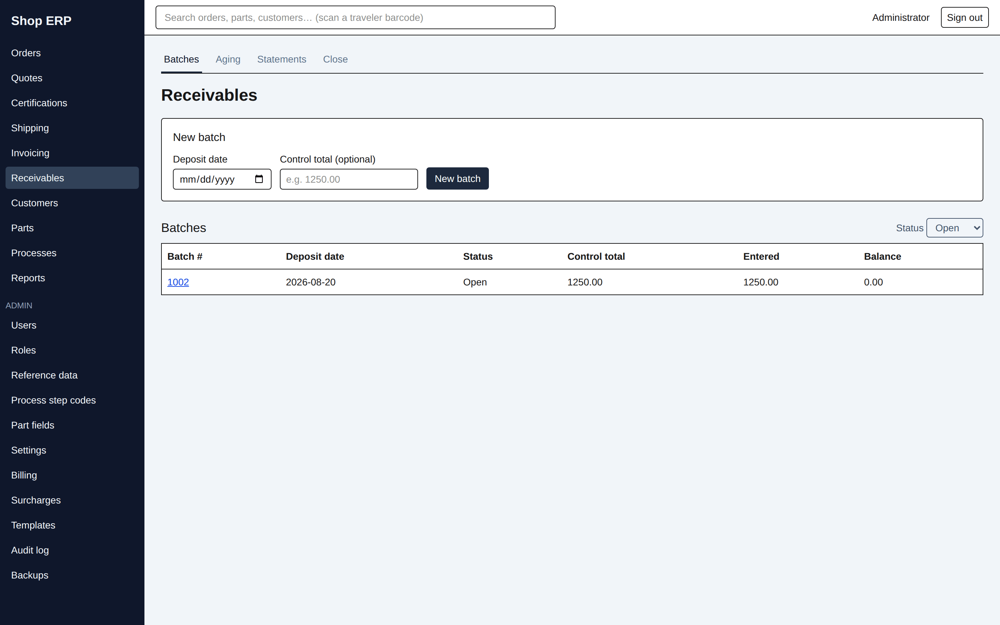
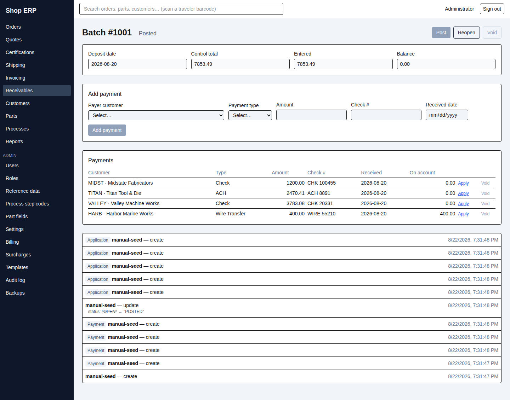
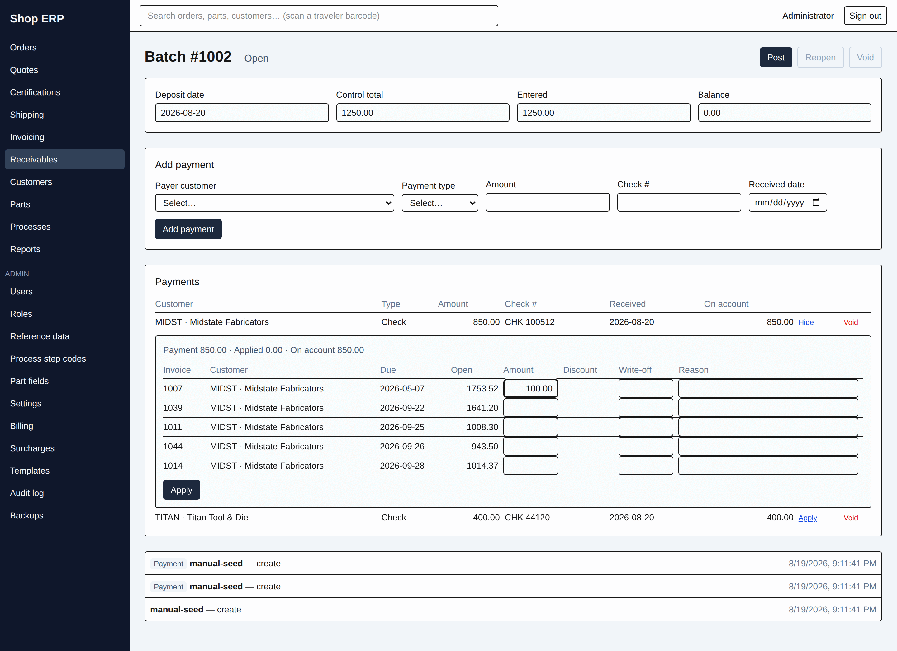
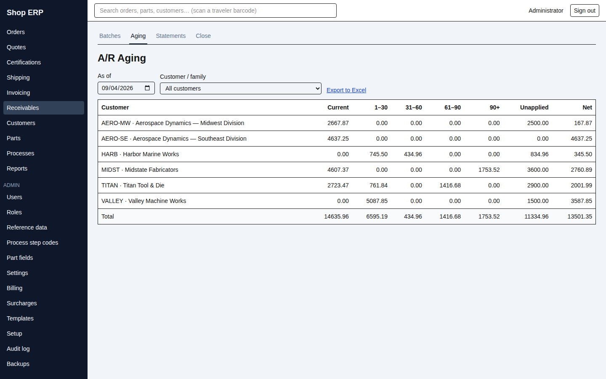
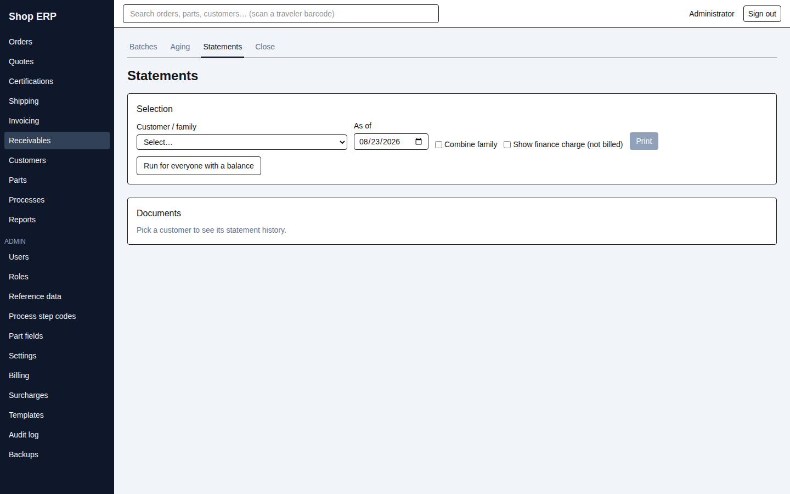

# 7. Receivables

[← Back to contents](README.md)

Receivables is where the money comes back in. Cheques arrive, get keyed into a deposit batch, and
get applied against the invoices they pay. What is left over is what the shop is owed.

The section has four tabs across the top: **Batches**, **Aging**, **Statements**, **Close**. This
chapter covers the first three; the Close tab is chapter 8.

## Deposit batches

Cash is never keyed straight onto an invoice. It goes into a **batch** — one batch per deposit —
and the batch is posted when it balances. That is the control: the batch total has to agree with
the deposit slip before the cash counts.

**New batch** needs a **Deposit date**, and optionally a **Control total** — the figure from the
adding machine or the deposit slip. Leave the control total blank and the batch will post without
any check at all; fill it in and the app will not let you post a batch that disagrees with it.

> **Get the control total right first time.** There is no way to edit it afterwards. A batch keyed
> against a mistyped control total has to be voided and re-keyed.

The worklist shows **Batch #**, **Deposit date**, **Status**, **Control total**, **Entered** and
**Balance**. It opens filtered to **Open** — the batches still needing work — and the filter also
offers **Posted** and **All**.

### Keying the cheques

The header repeats the four figures. **Balance** turns amber whenever it is not zero: that is the
difference between the control total and what you have actually keyed, and it is the number you are
working down.

**Add payment** takes the **Payer customer**, **Payment type**, **Amount**, **Check #** and
**Received date**. The received date will not accept a future date — *"The received date must be on
or before today — payments are entered after the deposit is in hand."* There is no way to correct a
payment after it is added, either: void it and key it again.

> **The payer is not always the customer on the invoice.** A parent company routinely pays for its
> divisions with one cheque. Key it against the payer, and the apply screen will offer you the whole
> family's open invoices.

### Posting

**Post** asks you to confirm: *"Once posted, no further payments can be added or voided."*

If the batch carries a control total, it must match what you have entered **to the cent**, and the
refusal tells you which way you are out and what to do about it:

> *"This batch does not balance — control total 5000.00, payments entered 4750.00 (difference
> 250.00). Enter the missing payments, or void this batch and re-key it with the correct control
> total."*

Over-entered, it says *"Void the extra payment"* instead. This is the whole reason the control total
exists, but note that the refusal arrives at post time — after every cheque is keyed — not as you go.

A batch cannot be posted into a closed month; every month its payments fall in must be open.

A posted batch can be put back with **Reopen**, which requires a reason: *"Its payments stop
counting as posted cash until it is posted again."* Reopening matters at month end — the continuity
schedule counts posted cash only (chapter 8).

**Void** discards a batch entirely, with a reason. It is deliberately awkward: a posted batch says
*"Reopen the batch first"*, and a batch with cheques in it says *"Void every payment first"*. Each
tooltip names the one thing that unblocks it.

## Applying a payment

Press **Apply** beside a payment to open its panel.

The line at the top is the payment's own arithmetic — **Payment**, **Applied**, **On account**.
Below it, every open invoice belonging to the payer's family: **Invoice**, **Customer**, **Due**,
**Open**, and three things you can type into — **Amount**, **Discount** and **Write-off** with its
**Reason**.

Fill in what the cheque pays against each invoice and press **Apply**. You can settle several
invoices, across several divisions, from one cheque in one go.

**Cash you do not apply is not lost — it sits on account.** The On account figure is what the
payment still has to spend, and it can be applied to a later invoice at any time, **including after
the batch is posted**. Applying is not part of editing the batch. (But read the trap below before
you rely on that.)

### Correcting a misapplication

Applications already made are listed at the top of the panel — **Invoice**, **Type**, **Amount** —
each with a **Void** control. Voiding one asks for a reason and puts the money straight back: the
invoice reopens by that amount and the payment's on-account goes back up. There is no reversing
entry to key.

This is the *only* way to correct a mis-applied payment, because a payment with live applications
refuses to be voided — *"This payment has applications — void them first"*. Void the applications,
then the payment.

## The early-pay discount — read this twice

Terms like **2% 10 Net 30** mean the customer may keep 2% if they pay within 10 days. When the
payment qualifies, the Discount column shows a checkbox reading **"Take 20.00"**. Tick it and the
discount is written alongside the cash.

**The rule that catches people out:**

> **A discount is earned only by a payment that settles the invoice.** A part payment inside the
> ten days earns nothing at all — not a proportional share, not a discount on the part paid.
> Nothing.

So on a $1,000 invoice at 2/10:

| The customer sends | Inside 10 days | What they may keep |
|---|---|---|
| $980 | yes | $20 — the cheque plus the discount close the invoice exactly |
| $500 | yes | nothing — the invoice is still open |
| $980 | no | nothing — the window has passed |

**Settlement is judged against what is *still open*, not the original total.** That is the useful
half of the rule. Say the customer paid $490 earlier, leaving $510 open. A second cheque inside the
window for **$499.80** settles that $510 with a $10.20 discount — 2% of what was still owed. They
earned nothing on the first payment, but the remainder can still be settled early.

The entitlement does not regrow as the balance drops, though: it is 2% of the invoice **total**, less
any discount already taken, and once spent it is gone.

When the discount does not apply, the checkbox simply is not offered. If you try to force one
through anyway the message names the arithmetic — *"an early-pay discount is earned only by a
payment that settles the invoice — this covers 500 of the 1000 open"*.

**Two further things worth knowing.**

The discount comes from the terms **the invoice was issued under**, frozen onto it when it was
finalized — not the customer's terms today. Moving a customer onto different terms never changes
what invoices already in their hands are worth, in either direction.

And the offer is **per invoice, not per grid**. A $1,000 cheque facing two $1,000 invoices will
show "Take 20.00" on both, because that cash could settle either one — just not both. Tick both and
the save refuses, correctly, because the cheque is not big enough.

> **A known rough edge:** when no discount applies, the message is the same three words —
> *"no early-pay discount applies"* — whether the window has passed, the invoice has no discount
> terms at all, or the entitlement is already spent. It does not tell you which. Check the invoice's
> terms and its date. This is filed as [#155](https://github.com/CoJoA13/HeatSynQ/issues/155).

## Write-offs

There are two, and they are not the same act.

**A residual write-off** is keyed in the apply panel alongside the cheque: the customer short-paid
by $4.17 and the shop absorbs it. Type the amount in **Write-off**, type a **Reason** — it is
required — and apply it with the payment. The reason is stored and shows in the history.

**A bad-debt write-off** has no payment behind it at all: the invoice will never be paid. That one
is raised from the customer's own A/R section (below) with the **Write off** button, not from a
batch, because there is no cheque to hang it on. It offers the full open balance by default, but you
can write off less. It too requires a reason — the placeholder asks for *"why this balance is being
written off"*.

The two differ in one way that matters at month end:

| | Effective date |
|---|---|
| Residual write-off, keyed with a cheque | the **payment's** received date |
| Bad-debt write-off, standalone | **today** — you cannot choose it |

Both need the month to be open, and neither counts toward settling an invoice for discount purposes
— absorbing a short payment is the opposite of being paid early.

**A fully written-off invoice stays on the list.** It does not disappear at zero. It stays in the
customer's open items carrying an amber **Written off** badge, and expands to show each write-off
— *"Written off 412.60 · on 2026-08-12 — customer in receivership"* — each with its own **Void**
control. That control is the only way to undo a write-off keyed by mistake, which is exactly why the
row is kept: an invoice that vanished at zero would be uncorrectable.

Voiding one warns you what will happen — *"The invoice's open balance comes back."* — and requires a
reason.

## The trap: cash stranded by a closed month

This one will happen to somebody in your office, so it is worth understanding before it does.

**When you apply a payment, the application takes the *payment's* received date — not today's
date.** That is right for the books: the cash belongs to the month it arrived in.

But a closed month accepts no postings. So:

> **Once the month a payment arrived in is closed, cash still sitting on account from that payment
> can never be applied to anything — ever — unless the month is reopened.**

The refusal is correct and the guard is doing its job. But the practical consequence is a real trap:
on-account cash has a deadline, and the deadline is the month-end close. **Clear on-account cash
before you close the month it arrived in.**

Two details soften the edges slightly. A **credit memo** applied to an invoice dates from *today*,
not from the credit's own date, so credits are not stranded the same way. And a standalone bad-debt
write-off also dates from today. It is specifically *payment* applications that inherit the old
date.

The demonstration data contains exactly this situation — the three payments in the closed July
batch are on account permanently. This is filed as
[#159](https://github.com/CoJoA13/HeatSynQ/issues/159) and is awaiting an owner decision; it is
documented here as behaviour, not as a recommendation.

## The aging report

**A/R Aging** answers "who owes us what, and how late is it". Two filters — **As of** and
**Customer / family**, which starts on **All customers** — and there is no Run button: change either
and the figures redraw. **Export to Excel** gives you a workbook of exactly the rows on screen.

One row per customer, code and name, then the buckets, then Unapplied and Net, with a **Total** at
the bottom.

**Pick a parent in the filter and the shape changes.** You get one row per *division* and a
**Family total** at the bottom covering the parent and every division together. The parent gets no
row of its own — its own invoices are in the family total. Do not read the divisions and expect them
to add up to a missing parent line; the total is the parent line.

**Invoices age by their due date, not their invoice date.** An invoice on Net 45 is not late until
45 days have gone by, and the buckets measure days past *due*:

| Bucket | Meaning |
|---|---|
| Current | Not yet due, or due today |
| 1–30 | Up to a month past due |
| 31–60 | One to two months past due |
| 61–90 | Two to three months past due |
| 90+ | More than three months past due |

Two more columns sit beside the buckets. **Unapplied** is cash and credits the customer has given
you that are not yet attached to an invoice. **Net** is the buckets less the unapplied — what they
genuinely owe once their cash on hand is taken into account.

**The as-of date genuinely reconstructs the past.** Set it back and the report shows the aging as it
stood on that day: invoices not yet finalized do not appear, and payments applied later are not
counted. Re-running a past date gives the same answer every time, which is what makes it usable as
evidence.

## Statements

A statement is the customer-facing summary of everything open: their invoices, their open credit
memos, and any cash on account — the last two as negatives, so the document adds up to what they
actually owe.

**Selection** takes a **Customer / family** and an **As of** date, plus two tick boxes.

| Control | What it does |
|---|---|
| **Combine family** | One statement covering a parent and all its divisions together |
| **Assess finance charges** | Works out an interest figure and prints it on the statement |

For a parent customer with the family box unticked, the button changes to **Print per division** and
produces one statement each — the parent and every division separately. **Run for everyone with a
balance** prints the whole round in one go; it confirms first, and reports honestly if a particular
customer's statement failed rather than silently dropping it.

**A parent customer cannot be printed on its own.** Choosing one and pressing Print is refused with
*"That customer has divisions — use Print per division, or tick Combine family"* — you have to say
which you meant.

The **Preview** below shows exactly what will print: the aging strip across the buckets, then
**Open items** — Document, Date, Due, Original, Open — then **Total due**. The open-item lines sum
to the total, because credits and on-account cash are in the list as negatives.

Printed statements are listed under **Documents**. Re-opening one gives you the exact bytes that
printed, unchanged.

> **A statement is rebuilt fresh each time you print it** — unlike an invoice, which is frozen when
> it is raised. Correct something in A/R and print the same customer for the same as-of date again,
> and the second statement will show the corrected figures. Both PDFs stay on file exactly as they
> were sent, so you can always show a customer what they were actually given.

> **The finance charge is printed, not charged.** Tick **Assess finance charges** and a **Finance
> charge** figure is computed from past-due balances at a monthly rate — the customer's own
> **Finance charge rate** if one is set, otherwise the plant default from Administration → Billing.
> But it is **not added to Total due**, it is **not posted** to the customer's account, and it
> **never ages**. It appears nowhere in the aging, the month-end schedule or the GL export, and it is
> recalculated from scratch on every print. It is a line on a piece of paper. **If the shop genuinely
> wants to collect interest, somebody must raise a real invoice for it.** The box is off by default,
> so nothing appears unless it is deliberately ticked.

## The customer's own A/R

Each customer's detail page carries an A/R section of its own (chapter 9). It shows that customer's
aging strip and, beneath it, the open items that add up to it — invoices, credit memos and
on-account cash together, so the total above the table can always be arrived at from the rows in it.

It is also where a standalone bad-debt write-off is raised, and where a written-off invoice's
**Void** control lives.

**It is scoped to that one customer alone** — never rolled up across a parent's divisions, even for
a parent. That is deliberate: it answers "what does this account owe", while the apply screen
answers the different question of "what could this cheque pay".

## Who can do what

| Action | Needs |
|---|---|
| See batches, aging, statements | `receivables.view` |
| Create a batch, add a payment, apply | `receivables.create` |
| Post or reopen a batch | `receivables.edit` |
| Void a payment, an application or a batch | `receivables.delete` |
| Write anything off | `receivables.create` **and** `write_off` |

`write_off` is a named action granted separately — a greyed-out write-off box reads *"Requires
write_off"*. In the demonstration data the Controller holds it and the Office Clerk does not.

---

Next: [8. Month end →](08-month-end.md) · Previous: [6. Invoicing](06-invoicing.md)
