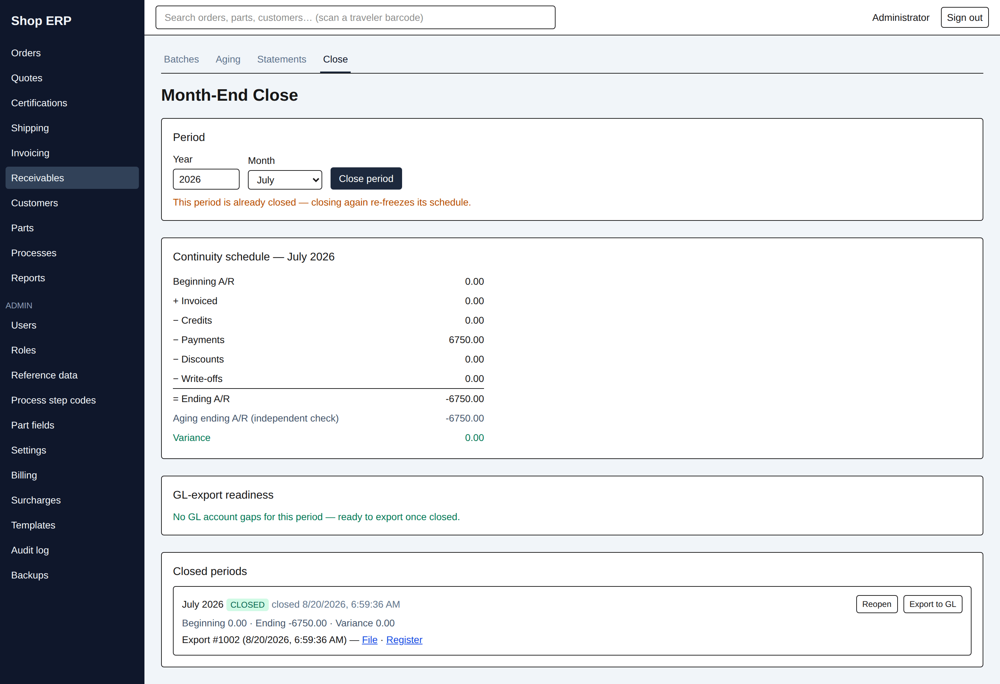

# 8. Month end

[← Back to contents](README.md)

Closing a month freezes it. After the close, nothing can post into that month — no invoice
finalized, no payment applied, no write-off, no credit — until somebody reopens it and says why.
That is the point: it is what makes last month's figures still true next week.

Everything in this chapter lives on **Receivables → Close**.

## The period

Pick a **Year** and a **Month**. The screen opens on the **month just finished**, not the current
one, because that is the month you are here to close.

## The continuity schedule

This is the month's A/R in one column of figures, and it is the whole of the close.

| Line | What it counts |
|---|---|
| Beginning A/R | Last month's frozen Ending A/R |
| + Invoiced | Invoices finalized this month |
| − Credits | Credit memos finalized this month |
| − Payments | Cash received this month, **from posted batches only** |
| − Discounts | Early-pay discounts taken this month |
| − Write-offs | Amounts written off this month |
| = Ending A/R | The arithmetic result |

**The month an invoice counts in is the month it was *finalized*, not the date on its face.** An
invoice dated 31 July but finalized on 2 August is August's. This is deliberate and it is the same
rule the aging and the Sales report use. It means the ordinary month-end habit — dating the paper
to the last day of the month and raising it a couple of days later — is handled correctly, but you
cannot back-date revenue into a month by typing an earlier invoice date.

**Only posted batches count as cash.** A receipt batch still open contributes nothing to the
schedule, even if its payments are dated inside the month.

### The variance is the real work

Under Ending A/R the screen shows two more lines:

| Line | What it is |
|---|---|
| Aging ending A/R (independent check) | The A/R aging, worked out a completely different way |
| Variance | The difference between the two |

The schedule adds up the month's *movements*. The aging adds up what each customer *owes*. They
are two separate calculations of the same number, and the close compares them rather than trusting
either. **A green zero means the books reconcile. A red figure means they do not, and the month
will not close until it is zero.**

The **Close period** button greys out with the reason in its tooltip — *"Variance must be zero to
close (currently 1250.00)"*.

> **In the demonstration data, August shows a variance of 1,250.00 — on purpose.** Above the
> schedule the screen already explains it: *"1 open receipt batch dated in this month is not yet
> posted — post first if it belongs in this close."* The schedule counts posted cash only, while
> the aging counts every payment; the gap between them is exactly that unposted batch. Post it and
> the variance goes to zero. This is the normal shape of a month-end problem, and the screen names
> its own cause.

A variance you cannot explain is worth chasing before you close, not after. The usual causes are an
unposted batch, a payment keyed into the wrong month, or an invoice finalized after you thought.

### Closing in order

Months must close in sequence. If the month before is not closed, the button says *"The prior month
must be closed first"*, and the server refuses with *"The prior period 2026-06 is not closed"*.

The one exception is the very first close the shop ever does: that month may begin at $0 with
nothing before it. After that, no skipping.

Closing a month that is already closed is allowed and simply re-freezes it — the screen warns
*"This period is already closed — closing again re-freezes its schedule."*

### Before you close: allocate the cash on account

An application is dated at the **payment's** received date, not at the day you allocate it. So the
moment a month closes, cash still sitting on account from a payment received in that month can no
longer be applied to anything — the application would be dated into a closed period, and the period
lock refuses it.

**So the last job before a close is to allocate on-account cash.** A cheque that arrives too late in
the month to match against an invoice should still be applied before month end. The Receivables
chapter says the same thing from the other side.

If cash does outlive its month, the route out is the sanctioned one and not a workaround: reopen the
month, apply it, close again. That is heavyweight on purpose — a late allocation genuinely changes a
closed month's aging, and the lock exists so that change is visible and audited rather than silent.

## Closed periods

Every month ever closed is listed at the bottom, newest first, with its frozen figures — Beginning,
Ending, Variance — the time it was closed, and a green **CLOSED** or amber **REOPENED** badge.

**CHAIN BROKEN** in red means this month's frozen beginning no longer matches the month before it
— usually because that earlier month was reopened and re-closed at a different figure. Nothing is
blocked and nothing cascades; the row tells you the way out in words, and it is always the same
one: re-close this month to re-chain it.

### Reopening

**Reopen** asks you to confirm — *"Reopen July 2026? Postings will be allowed into it again until
it is re-closed."* — and then requires a **reason**, which is recorded in the audit history.

Reopen when a correction genuinely belongs in the closed month. Post the correction, then close the
month again. A reopened month cannot be exported to the GL until it is re-closed.

> Two things the demonstration data cannot show. A month sitting **reopened** — re-closing updates
> the same row in place, so July's reopen survives only in the audit log. And a **closed month with
> invoicing in it**: because recognition is by finalize date, seeded invoices all land in the month
> the data was built, so closed July shows cash movement and zero invoiced. Both are properties of
> the system, not gaps in the screen.

## The GL export

The shop's ERP is not the shop's books. The export is how a closed month gets to the bookkeeper.

### Readiness comes first

The **GL-export readiness** panel lists everything that would make the export wrong, each with a
**Fix** link straight to the screen that fixes it:

| Example gap | Where it is fixed |
|---|---|
| "A/R control account is not set" | Administration → Billing |
| "Process step code HT has no GL account" | Administration → Step codes |
| "Surcharge Energy has no GL account" | Administration → Surcharges |
| "Payment type Check has no GL account" | Administration → Reference |
| "Invoice 1042 has a line with no GL account — unlock and re-finalize it" | That invoice |

When it is clear it says so: *"No GL account gaps for this period — ready to export once closed."*
There is also an **Export gap list to Excel** link when the list is long enough to work through
away from the screen. Every account-bearing line needs an account — freight and other charges and
certification too, not only process steps — and the export refuses while any gap remains.

### Exporting

**Export to GL** on a closed period's row produces two things, both listed on that row afterwards
and both downloadable at any time:

| | What it is |
|---|---|
| **File** | `gl-2026-07.csv` — the entries, for import into the accounting package |
| **Register** | `gl-register-2026-07.pdf` — the same entries as a readable printed register |

The file has five columns — **Date, Account, Debit, Credit, Memo** — all dated the last day of the
period.

**The file is a summary.** One line per account per side, with the amounts added together — not one
line per invoice. A month of two hundred invoices might export as a dozen lines. That is what a
bookkeeper wants in the general ledger, and **the ERP keeps the detail**: every individual invoice,
payment, discount and write-off is still recorded here and still reportable. The register PDF
prints the same summary in two parts, sales first then cash.

Before anything is written, the export proves that debits equal credits. If they ever did not, it
would refuse rather than hand over a file that will not balance.

### Exporting twice

The export sends only **what has not been sent yet**. Press it again on a month where nothing has
changed and it refuses with *"Nothing to export — this period has no unexported postings"* — no
file, no export number consumed, nothing double-posted.

If something in that month genuinely does change — a correction after a reopen and re-close — the
next export carries a reversal of what was sent before plus the corrected entry, so the bookkeeper's
ledger ends up right without anybody unpicking the earlier import by hand.

## What the bookkeeper receives

For each closed month, hand over:

1. **The CSV** — the summary journal entries to import.
2. **The register PDF** — the same figures in readable form, to file with the month.
3. **The continuity schedule** from this screen, if they want to see the month's movement proved.

Everything else stays here. Questions about *which* invoices make up the sales figure are answered
by the invoice register and the Sales report (chapter 11), not by the export file.

## Who can do this

| Action | Needs |
|---|---|
| See the screen and the schedule | `receivables.view` |
| Close or reopen a period | `receivables.edit` **and** `close_ar_period` |
| Export to GL | `receivables.edit` **and** `run_qbo_export` |

Those last two are *named actions*, granted separately from ordinary permissions — a greyed-out
button says *"Requires close_ar_period"* rather than naming a section.

These are deliberately separate from ordinary receivables work. In the demonstration data the
Controller role holds them and the Office Clerk does not.

---

Next: [9. Customers →](09-customers.md) · Previous: [7. Receivables](07-receivables.md)
