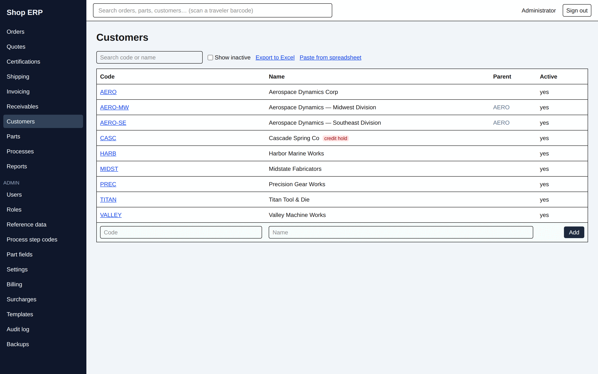
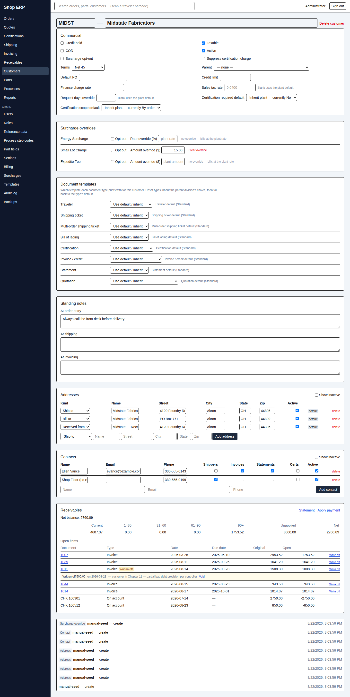

# 9. Customers

[← Back to contents](README.md)

The customer record is where the shop's commercial agreement with an account lives: their terms,
their tax status, their addresses, who to send paper to, and whether they are good for the work.

## The list

**Customers** shows **Code**, **Name**, **Parent** and **Active**. Search matches the code or the
name. **Show inactive** brings back the ones that have been retired, and **Export to Excel** gives
you the list as it stands.

A customer on credit hold carries a red **credit hold** pill beside their name, so you can see it
without opening anything.

New customers are added on the bottom row of the table — a **Code** and a **Name** is all it takes;
everything else is filled in on the record itself. **Paste from spreadsheet** takes a block of
customers at once (code, name, default PO and order notes).

## The customer record

The code and name at the top are editable in place. Below them, one section at a time.

> **Most fields save when you leave them.** There is no Save button on this screen. Type, then tab
> or click away, and it is saved. If the app refuses a value the box snaps back to what was stored
> and a red message says why.

### Commercial

The commercial terms of the account. Six tick boxes — **Credit hold**, **Taxable**, **COD**,
**Active**, **Surcharge opt-out**, **Suppress certification charge** — and then:

| Field | What it does |
|---|---|
| **Terms** | Their payment terms. This is what drives due dates and the early-pay discount |
| **Parent** | Makes this customer a division of another (below) |
| **Default PO** | Filled in for them at order entry |
| **Credit limit** | Recorded on the account |
| **Finance charge (monthly %)** | Their own monthly rate for the statement's finance-charge line, as a percent — 1.5 means 1.5% per month; blank uses the plant default |
| **Sales tax rate (%)** | Their own rate, entered as a percent — 7 means 7%; *"Blank uses the plant default."* Only ever used if **Taxable** is ticked |
| **Request days override** | Their own lead time in days; blank uses the plant default |
| **Certification required default** | Yes / No / inherit |
| **Certification scope default** | By order / By load / By shipment, or inherit |

The two certification controls have a three-way choice, and the inherit option tells you what it
currently means — *"Inherit plant — currently Yes"*, *"Inherit plant — currently By order"* — so you
are never guessing what leaving it alone will do. A part can override this again (chapter 10).

**Taxable and the tax rate are two different decisions.** The tick box decides *whether* tax is
billed; the rate decides *at what rate*. Untick the box and the rate is ignored entirely.

### Divisions

A division is just a customer with a **Parent** set. Choose the parent from the dropdown and the
header changes to read **Division of AERO**. There is no separate "add a division" action.

The app will not let you tangle the tree: *"A customer cannot be its own ancestor"* and *"That
parent would create a circular relationship"*. A parent cannot be deleted while it still has live
divisions.

> **Divisions inherit far less than people expect.** This trips people up, so it is worth being
> blunt about it.

| | Inherited from the parent? |
|---|---|
| Document templates | **Yes** — this is the only thing that inherits |
| Terms | No — set them on each division |
| Addresses and contacts | No — each division keeps its own |
| Credit hold, credit limit, tax, surcharge opt-out | No |
| Certification defaults | No — a division falls back to the **plant** setting, never the parent's |

Two things *are* family-wide, and they are both about money coming in: **one cheque can settle
invoices across the whole family**, and a **statement can be printed combined** for the family or
one per division (chapter 7).

Setting a parent's terms does **not** push them down to the divisions. If the whole family trades on
2% 10 Net 30, every division needs it set.

### Surcharge overrides

Energy and similar surcharges are set up plant-wide (chapter 12); this section is where one customer
departs from them. Per surcharge you can tick **Opt out**, or type a **Rate override (%)** or an
**Amount override ($)**. A surcharge with nothing set says so in plain words — *"no override — bills
at the plant rate"* — and **Clear override** puts it back.

Changing prices is a guarded thing: this section needs `customers.edit` **and** the `change_prices`
action.

### Document templates

Which template each of the eight document types prints with for this customer, with the rule stated
on the screen: *"Unset types inherit the parent division's choice, then fall back to the type's
default."*

Every row tells you where its answer actually came from — **Assigned: Invoice — Aerospace layout**,
or **Inherited from AERO — Aerospace Dynamics Corp: …**, or **Invoice / credit default (Standard)**.
Leave a row on **Use default / inherit** and it follows the chain.

A template that has never been published is listed but cannot be chosen: *"This template has never
been published — publish a version before assigning it"*.

### Standing notes

Three free-text notes that surface at the three moments they matter: **At order entry**, **At
shipping**, **At invoicing**. Use them for the things a new person would not know — "always call
before delivery", "PO must appear on the invoice".

### Addresses

Three kinds — **Ship to**, **Bill to** and **Received from** — listed with **Kind**, **Name**,
**Street**, **City**, **State**, **Zip** and **Active**.

**There is one default per kind, not one per customer.** The first active address of a kind becomes
that kind's default on its own; after that, **make default** moves the badge. The app keeps this
tidy for you — an address that is deleted or deactivated never keeps the default badge, and the flag
falls to another live address of that kind.

Which one gets used where:

| Document | Address used |
|---|---|
| Shipment and BOL | A **Ship to** you pick from that customer's live ship-to addresses |
| Invoice | The default **Bill to** and **Ship to**, frozen onto the invoice when it is raised |
| Certificate and statement | The default **Bill to** |
| Traveler | **Received from** |

### Contacts

**Name**, **Email**, **Phone**, and four tick boxes deciding what they get: **Shippers**,
**Invoices**, **Statements**, **Certs**.

Only the name is required. **Email is optional** — plenty of shop contacts are phone-only — but if
you type one it has to be a real address, because a typo fails silently when documents are sent.

### Receivables

That customer's own A/R: a **Net balance**, an aging strip across the buckets, and **Open items**
underneath — Document, Type, Date, Due date, Original, Open. Type reads **Invoice**, **Credit** or
**On account**. When there is nothing outstanding it says *"Nothing open — this customer is
settled."*

**This section is scoped to this customer alone.** It is never rolled up across a family, even for a
parent. That is deliberate, and it means:

> The same parent customer will show one figure here and a different one on the A/R aging report,
> and **both are right**. This section answers "what does this account owe". The aging report, when
> you filter it to a parent, answers "what does this family owe". Know which question you are
> asking.

It is also where credits are applied (**Apply**) and where a bad-debt balance is written off
(**Write off**) — see chapter 7.

## Credit hold

Credit hold is one tick box on the Commercial section, and it behaves differently at the two points
it matters.

**At order entry it warns and lets you through.** The new-order screen shows an amber banner:

> *"⚠ CASC is on credit hold — orders can be entered; shipping will require release."*

That is the intended behaviour, not a leak. Taking the order costs nothing; letting the parts leave
the building is the decision.

**At shipment it stops you.** Saving a shipment for a held customer is refused:

> *"CASC · Cascade Spring Co is on credit hold — see /customers/… to lift it"*

Someone holding the **`override_credit_hold`** action can push it through, but only with a
**reason** — the shipping screen makes that explicit: *"Saving this shipment records a credit-hold
override. Reason (required, kept in the audit history — printed nowhere)."* A blank reason is
refused. Without that action there is no reason box at all, just *"Saving a shipment for them
requires the override_credit_hold action."*

The reason goes into the audit history and **never onto the paperwork** — the customer's BOL does
not announce that their credit was overridden.

**Lifting a hold** is untieing the box on the customer record, which needs `customers.edit`. That is
the route every refusal points at.

## Deleting a customer

**Delete customer** asks for a reason and tells you exactly what it means:

> *"Its addresses and contacts are deleted with it. The code can be reused later, which starts a
> fresh customer rather than restoring this one."*

That last sentence matters. Re-using a deleted code does not bring the old customer back — it makes
a brand-new one with its own history.

A customer that is still in use will not delete, and the app names what is holding it: divisions,
parts, live orders, live quotes or live payments. For the counted ones a panel lists the actual
records with an **Export list to Excel** so you can work through them.

---

Next: [10. Parts and processes →](10-parts-and-processes.md) · Previous: [8. Month end](08-month-end.md)
