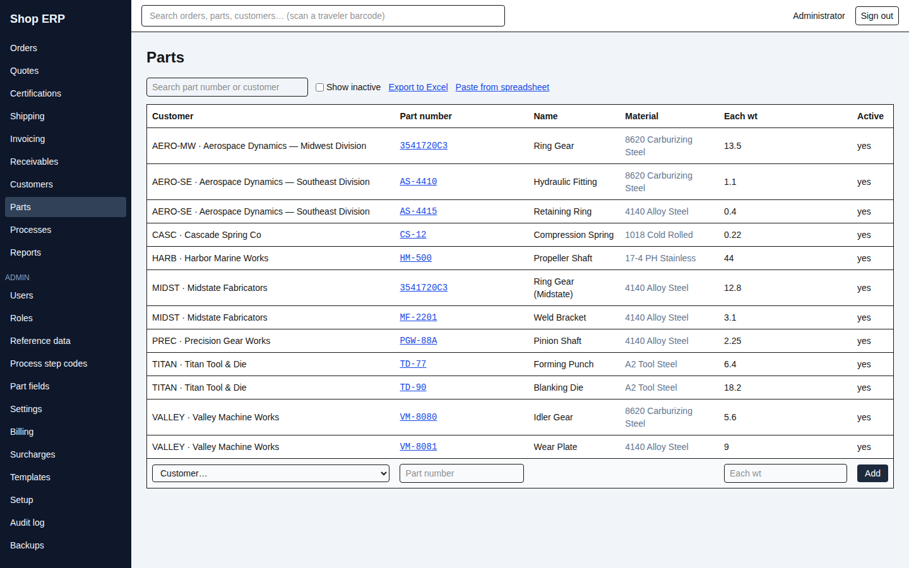
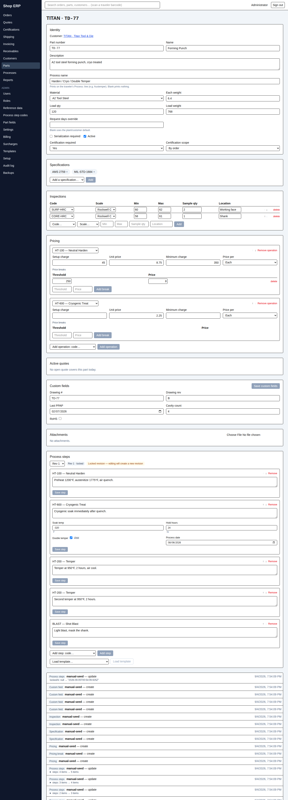
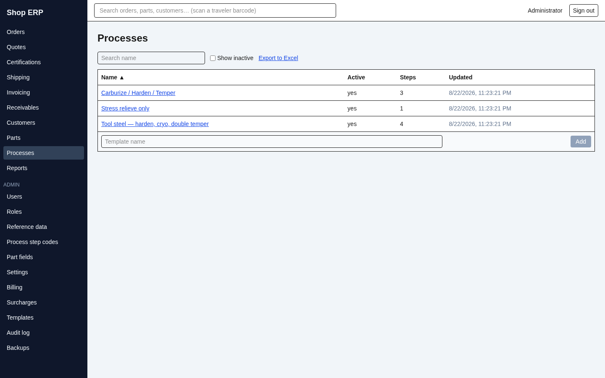
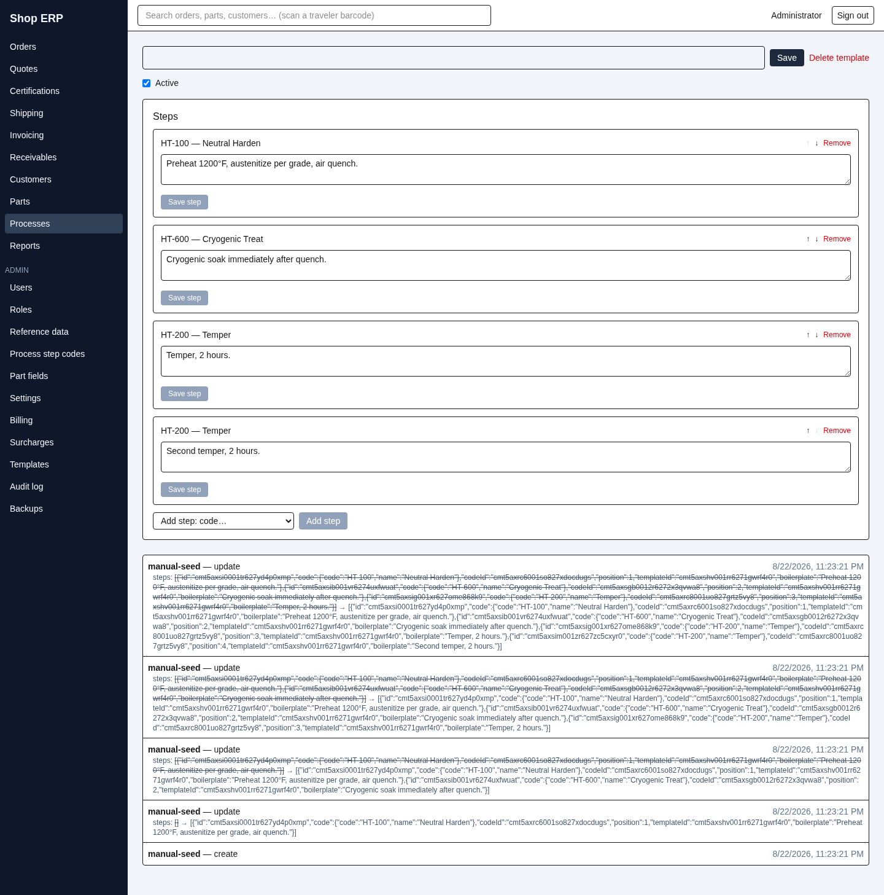

# 10. Parts and processes

[← Back to contents](README.md)

A part in this system is a **memorized job**: the customer's part number, what it is made of, the
recipe that runs it, what it costs, and what has to be inspected. Memorize it once and every order
for that part comes in ready.

## Part numbers belong to the customer

This is the single most important idea in this chapter, and it is different from how most
inventory systems work.

> **A part number belongs to a customer, not to the shop.** `3541720C3` can exist for two different
> customers and mean two different parts, with different recipes and different prices. Neither one
> is "the" 3541720C3.

Everything follows from that:

- A part number only has to be unique **within one customer**. Key it twice for the same customer
  and you get *"A part with that part number already exists for that customer"*.
- **A part cannot be moved to another customer.** The app says so: *"A part cannot move to another
  customer — deactivate it and key a new part instead."*
- **An order cannot borrow another customer's part**, however identical the work. Try it and you
  get *"Line 3 (ACME · 12345-A): that part belongs to another customer"*. Order entry normally
  prevents this by only offering the selected customer's parts.
- Deleting a part frees its number for re-use by that customer, and re-using it **starts a fresh
  part** rather than restoring the old one.

## The parts list

**Parts** lists **Customer**, **Part number**, **Name**, **Material**, **Each wt** and **Active**.

**It is one list for the whole shop, not one per customer** — there is no customer filter. The
search box is how you narrow it, and it matches a part number *or* a customer code *or* a customer
name, so typing a customer's code is the practical way to see their catalogue.

**Show inactive** brings back retired parts, **Export to Excel** exports what you see, and **Paste
from spreadsheet** loads parts in bulk. Prices are deliberately not pasteable — they are keyed on
the part.

## The part record

One long screen, in this order: **Identity**, **Specifications**, **Inspections**, **Pricing**,
**Active quotes**, **Custom fields**, **Attachments**, **Process steps**, and the History panel.

As on the customer screen, most fields **save when you leave them**. The exceptions are **Save
step** and **Save custom fields**, which are explicit.

### Identity

The customer is shown but cannot be changed. Then **Part number**, **Name**, **Description**,
**Process name**, **Material**, **Each weight**, **Load qty**, **Load weight** and **Request days
override**, plus **Serialization required** and **Active**.

Two of these do more than they look like:

**Load qty** and **Load weight** are what split an order into furnace loads (chapter 2). Get them
right and order entry does the splitting for you.

**Process name** is print-only: *"Prints on the traveler's Process: line (e.g. Austemper). Blank
prints nothing."* It is a label for the floor, not the recipe.

The two certification controls work like the customer's, one level down — their inherit option reads
**"Inherit — currently Yes"**, because a part inherits from its *customer* first and the plant only
behind that.

## The recipe — process steps

**Process steps** is the recipe: the operations this part goes through, in order, with the
instructions and the settings the floor needs.

Each step is a **step code** (HT, TEMPER, STRAIGHTEN…) with an **Instruction** and, if that code has
been set up with them, a set of typed fields — a temperature, a soak time, a date, a tick box. Those
field definitions live on the step code in Administration, so every part using that code asks for
the same numbers in the same units.

**↑** and **↓** move a step; **Remove** takes it out; **Save step** commits it.

### Revisions — what happens when you edit a recipe

Recipes change, and paper is already on the floor. The app handles that with revisions, and it does
it quietly enough that it is worth knowing the rule.

At the top of the section is a revision picker and a badge reading either **Rev 2 · working** or
**Rev 2 · locked**.

| State | What it means |
|---|---|
| **working** | Nobody has run this recipe yet. Edits change it in place |
| **locked** | An order has been placed against it. It is now a historical record |

**A revision locks when an order is saved against the part** — specifically the order's lead part.
From that moment the recipe describes work that is really happening, so it stops being editable in
place.

You are not blocked from editing it. Instead, an amber chip appears:

> *"Locked revision — editing will create a new revision"*

and the next change you save **cuts a new revision**, copying every step, instruction and value
across, and moves you onto it. The locked revision stays exactly as it was, so the traveler that
printed still matches a recipe you can look up.

Older revisions are read-only — every control on them carries *"Superseded revision — read-only"*.

> **A part with no process steps cannot be the lead part on an order.** The lead-part picker greys
> it out with *"No process steps"*. If a new part will not go on an order, this is almost always why.

### Process templates

**Processes** holds reusable step skeletons — "Tool steel — harden, cryo, double temper" and so on —
so a common recipe does not have to be keyed step by step every time.

A template is a name and an ordered list of steps, each a step code plus free-text **Boilerplate**.
That is all it holds: no temperatures, no times, no typed values.

You apply one from the part's Process steps section — pick it under **Load template…** and press
**Load template**.

> **A template is a one-time copy, and it replaces everything.** Read that twice, because both
> halves surprise people.
>
> **It replaces.** Loading a template **deletes every existing step and every recorded value** on
> the working revision first — including steps the template does not have. The confirmation is your
> only warning: *"Replace the current steps with this template's blank skeleton?"*
>
> **It is a copy, not a link.** Nothing connects the part to the template afterwards. Editing the
> template later changes **nothing** on any part already built from it, and there is no way to push
> an update out. If a recipe changes for twenty parts, twenty parts get edited.
>
> And it comes across **blank**: instructions arrive from the boilerplate, but every temperature,
> time and tick box is empty and has to be filled in.

If the current revision is locked, loading a template cuts a new revision first, exactly like any
other edit.

## Pricing

**Pricing** is per **operation**, not one price for the part: each priced step code is its own card,
because that is how heat treating is actually sold.

Each operation carries four figures:

| Field | What it means |
|---|---|
| **Setup charge** | A fixed charge for the run |
| **Unit price** | The rate for the work |
| **Minimum charge** | A floor on the work |
| **Price per** | What the unit price is measured in |

**Price per** offers **Each**, **Per lb**, **Per 100**, **Per 1,000** and **Lot (flat)**.

**The setup charge sits on top of the minimum, never inside it.** The work is priced, the minimum is
applied if the work comes to less, and then setup is added. A $50 minimum with a $25 setup on a
small job bills $75.

### Price breaks

Below each operation sit its **Price breaks** — a **Threshold** and a **Price**, as many tiers as
the account needs.

**The tier that wins is the highest threshold that does not exceed the quantity.** With breaks at
100, 500 and 1,000, an order of 750 pays the 500 price. Below every threshold, the operation's own
**Unit price** applies.

**What the threshold is measured in follows the unit** — pounds on a **Per lb** operation, pieces on
everything else. Note that includes **Per 100** and **Per 1,000**: a threshold of 500 on a Per 100
row means 500 *pieces*, not 500 hundreds.

> **A LOT price cannot have breaks.** A lot price is one flat figure for the job, so tiers are
> meaningless against it. The app refuses both directions with the same words: *"A LOT-priced
> operation cannot carry price breaks."* You cannot add a break to a LOT operation, and you cannot
> switch an operation to LOT while it still has breaks — delete the breaks first.

> **Changing the unit does not convert the numbers.** Switch an operation from Each to Per 100 and
> the app warns you plainly: the unit price and every break's threshold and price *"are all read
> today as Each amounts… Switching to Per 100 does not change any of those stored numbers — every
> one of them will be read as a Per 100 amount from now on."* You must re-key them yourself. This is
> the easiest way in the whole system to bill a customer a hundredth of what you meant to.

**There is no effective dating on part prices.** A price is the price; change it and the new figure
applies to work invoiced from then on. What *does* displace a part price is a live quote for that
part — that is what the **Active quotes** section is showing you.

An operation with neither a unit price nor a minimum is not silently dropped: it comes through onto
the invoice as a line needing a price, where somebody has to deal with it.

## Specifications and inspections

These are two different things and only one of them prints.

**Specifications** are a simple list of the customer or industry specs the part is made to — picked
from the reference list, shown as chips, removed with an ×. They record what the part is built to.
**They do not print on any document**; do not memorize a spec here expecting it to appear on the
certificate.

**Inspections** are the key characteristics that get measured: **Code**, **Scale**, **Min**,
**Max**, **Sample qty** and **Location**.

These do print, in two places. They go onto the **traveler** under *"Key Characteristic
Inspection(s):"*, so the floor knows what to check. And they seed the **certification** requirements
for the part, so the results the customer is certified on are the ones you said mattered.

**Sample qty is free text on purpose.** Real inspection plans say "8" on one row and "100%" on the
next, and a numeric field would reject half of them. Type what the plan says.

## Custom fields

If the shop needs to record something the app has no box for — a customer's drawing revision, a
nadcap flag, a re-qualification date — an administrator defines it once under **Part custom fields**
(chapter 12) and it appears on every part.

Fields can be **TEXT**, **NUMBER**, **DATE** or **CHECKBOX**. Unlike the rest of the screen this
section is a batch save: fill in what you need and press **Save custom fields**.

A tick box you have touched counts as filled in, even when unticked. That is what the small **clear**
link beside it is for — it returns the field to genuinely unset, which is what an administrator needs
before the field's type can be changed or the field retired.

## Deleting a part

**Delete part** asks for a reason and spells out the consequence:

> *"Its specifications, inspections, and prices are deleted with it. The part number can be reused
> later for this customer, which starts a fresh part rather than restoring this one."*

A part on a live order or a live quote will not delete, and the app says which. Deactivating is
usually the better move: an inactive part stops being offered at order entry but keeps its history
and its prices intact.

---

Next: [11. Reports →](11-reports.md) · Previous: [9. Customers](09-customers.md)
