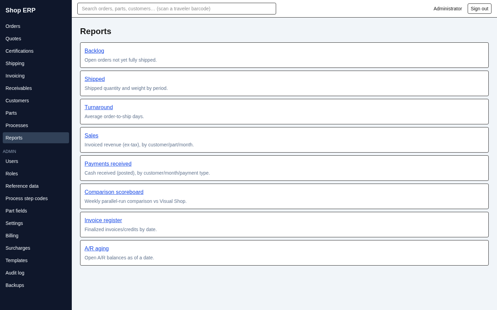
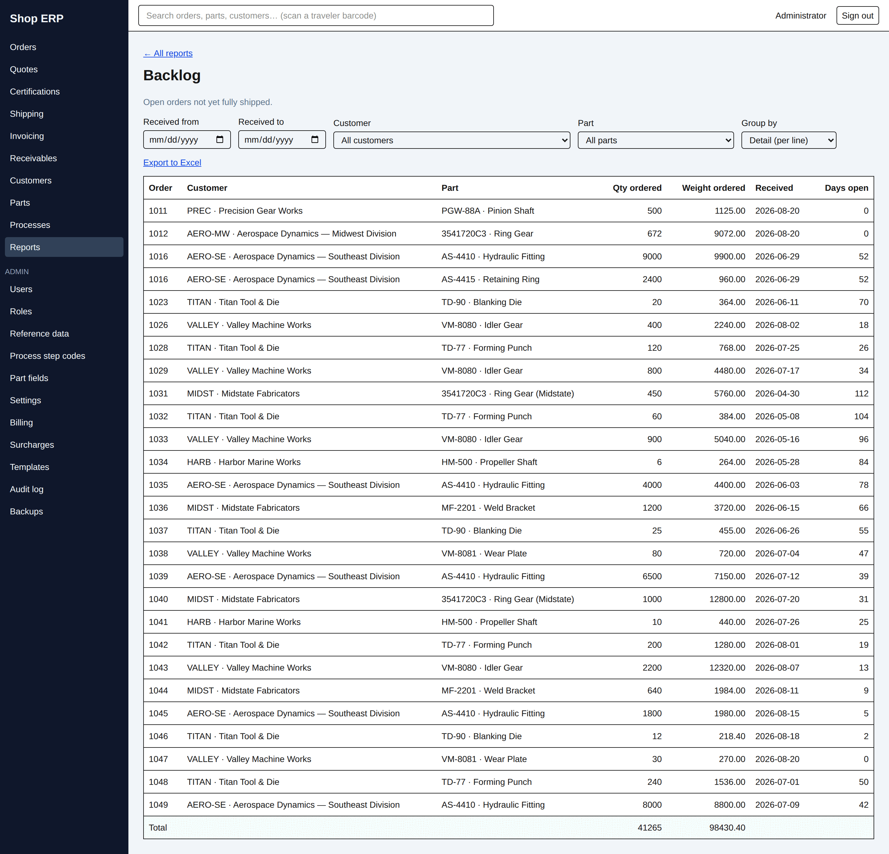
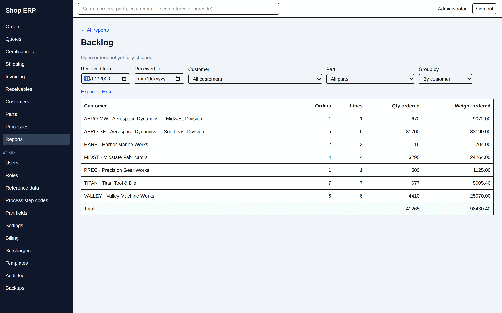
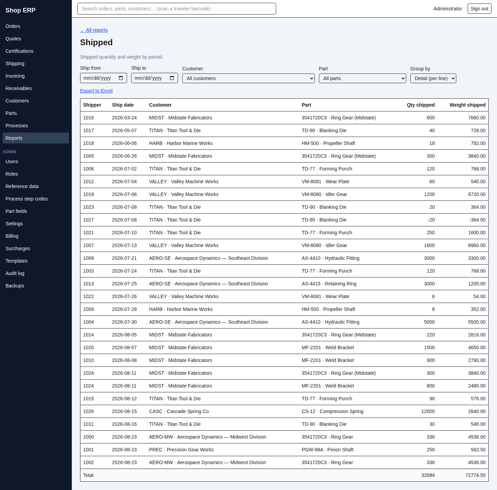
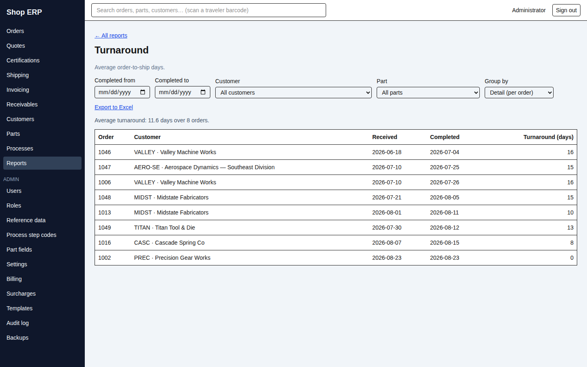
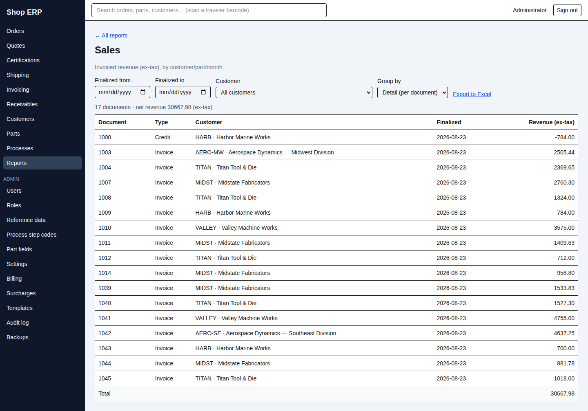
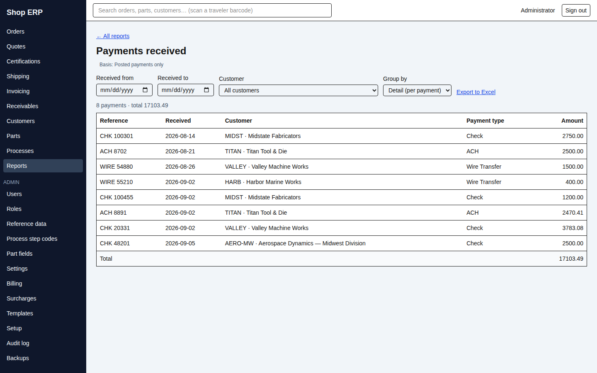
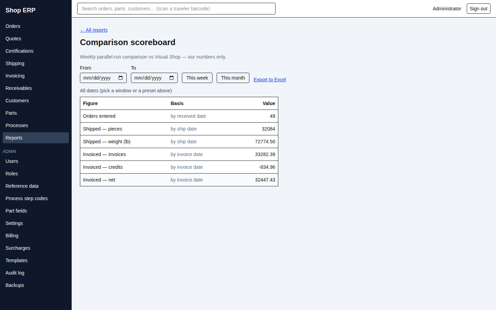

# 11. Reports

[← Back to contents](README.md)

Reports answer questions about work that has already happened. **They only ever read.** No report
changes a record, prints a document, or posts anything — you cannot break the books by running one,
and you cannot fix them there either.

## The reports index

**Reports** in the left rail opens the catalogue.

Each entry is one report, with a line saying what it covers. **You only see the reports you have
permission to see** — and the rule is finer than it looks: reaching this page needs permission to
view reports at all, but each entry is then gated on the area it actually draws from. Somebody who
can see reports but not invoicing will find the invoice register missing from this list while the
others are all present. A short list is normal.

If nothing at all is available to you the page says *"No reports are available to you yet."*

Six of the entries are reports in their own right. The last two are **homed** entries — screens
that live elsewhere in the app and are listed here as a convenience:

| Entry | What it is | Where it actually lives |
|---|---|---|
| Invoice register | Finalized invoices/credits by date | The Invoicing screen (chapter 6) |
| A/R aging | Open A/R balances as of a date | Receivables (chapter 7) |

Following either one takes you to that screen, which is documented in its own chapter.

## What every report shares

All six native reports work the same way, so learning one teaches you all of them.

**Filters across the top.** Always a date range, usually **Customer** and **Part** dropdowns
(defaulting to *All customers* and *All parts*), and a **Group by** selector.

**Group by** is the whole point of these reports. Every one offers a *Detail* mode — one row per
line, order, document or payment — plus rolled-up modes. Switching to *By customer* replaces the
detail rows with one row per customer and totals across them.

**A footer row labelled Total.** In grouped modes the count columns are deliberately left blank —
counts of orders or documents do not meaningfully add up once rows have been rolled together, so
the app leaves the cell empty rather than print a misleading number.

**Export to Excel**, at the top of every report.

> **The export and the screen can never disagree about the data.** The link is built from the
> filters of the result **currently on screen**, not from the filter boxes as you have just left
> them. Change a filter without reloading and the table dims and shows *"Updating…"* — and the
> export still hands you the rows you can see. Before the first successful load the link is inert,
> with the tooltip *"Loading the current view…"*.

Two honest caveats about the file itself, because "matches the screen" is not quite the same as
"identical":

- **The spreadsheet splits some columns.** One on-screen **Customer** column becomes *Customer
  Code* and *Customer Name*; one **Part** column becomes *Part Number* and *Part Name*. Same
  information, laid out for sorting.
- **The spreadsheet has no Total row.** The footer totals and the summary sentences above the table
  are screen furniture. The file contains the rows; add up the column yourself in Excel.

If your Customer or Part dropdown is greyed out, hover it — you do not have permission to view
customers or parts, and the report is limited accordingly.

## Backlog

Open work not yet fully shipped: what the shop still owes.

Filtered by **Received from** / **Received to**, customer and part. Grouping: *Detail (per line)*,
*By customer*, *By part*, *By received month*.

Detail columns are **Order**, **Customer**, **Part**, **Qty ordered**, **Weight ordered**,
**Received** and **Days open**. When there is nothing outstanding it says *"No open backlog"*.

> **Days open is always counted to today**, even when you have filtered to a window that ended
> months ago. It answers "how long has this been sitting", not "how long had it been sitting then".

## Shipped

What went out, by quantity and weight.

Filtered by **Ship from** / **Ship to**, customer and part. Grouping adds *By ship day* to the usual
set, which is the one to use when somebody asks what left the building on a particular date.

Detail columns are **Shipper**, **Ship date**, **Customer**, **Part**, **Qty shipped**, **Weight
shipped**. Empty range reads *"Nothing shipped in range"*.

> **Choosing a part can quietly reduce the total.** If an order line was later removed, its shipped
> rows survive on the shipment (chapter 4) but no longer point at a part. Those rows are counted
> under *All parts* and dropped as soon as you name a part. If a part total looks light against the
> unfiltered figure, that is the reason.

## Turnaround

How long orders take, from received to shipped complete.

Filtered on **Completed from** / **Completed to** — the date the order finished, not the date it
arrived. Grouping: *Detail (per order)*, *By customer*, *By part*, *By completion month*.

Above the table it prints the headline: *"Average turnaround: N days over M orders."* Detail columns
are **Order**, **Customer**, **Received**, **Completed**, **Turnaround (days)**; grouped mode shows
**Orders**, **Avg days**, **Min** and **Max**, which is usually what you actually want — an average
with no spread beside it hides the one job that took eleven weeks. This is the only report with no
Total row, because averages do not total.

Two things to know before quoting this number to a customer:

> **It counts only orders sitting at Shipped.** Once an order is invoiced it leaves this report
> entirely. Run the same month twice a few weeks apart and the average will have moved, because
> billing has removed the finished work from underneath it. This is worth understanding before you
> use turnaround as a performance measure.

> **Grouped *By part*, the Orders column over-counts.** An order covering three parts is counted
> once under each of them, so the column adds up to more than the order count in the sentence above
> the table. The average days per part are right; the order counts are not a total.

## Sales

Invoiced revenue, excluding tax.

Filtered on **Finalized from** / **Finalized to** and customer — there is no part filter here.
Grouping: *Detail (per document)*, *By customer*, *By part*, *By finalized month*.

Detail columns are **Document**, **Type** (*Invoice* or *Credit*), **Customer**, **Finalized** and
**Revenue (ex-tax)**, with a net figure summarised above the table. Credits count against the
total, which is why it is described as net.

**Sales recognises revenue on the date an invoice was finalized**, not the date printed on it. An
invoice dated the 28th of July but finalized on the 2nd of August is August revenue. That is a
deliberate decision and it matches how the month-end close and the aging behave (chapter 8), so the
three agree with each other.

Two things people are surprised by:

> **"Revenue (ex-tax)" means everything except tax** — freight, surcharges, extra charges and cert
> charges are all in the figure. It is not part revenue alone.

> **Grouped by part, lines with no part number collect in a row labelled `(no part)`.** Freight and
> similar charges have no part, and this is where they go.

**One limitation of the demonstration data, stated plainly:** the sample database cannot show Sales
across more than one month. Finalizing always stamps the current date and Sales recognises on that
stamp, so every invoice in a freshly-built sample lands in the month it was built. A real
month-over-month comparison needs a system that has genuinely been in use across months — nothing
is wrong with the report.

## Payments received

Cash in.

Filtered on **Received from** / **Received to** and customer. Grouping: *Detail (per payment)*, *By
customer*, *By received month*, *By payment type*.

Detail columns are **Reference**, **Received**, **Customer**, **Payment type** and **Amount**, with
the count and total above the table.

The screen carries its basis as a permanent label — **Basis: Posted payments only**. Money keyed
into a receipt batch that has not been posted yet does not appear here at all (chapter 7). If the
report looks light against what you know came in the door, an unposted batch is the first thing to
check.

## The comparison scoreboard

This one exists for a single purpose: running HeatSynQ alongside Visual Shop and checking that the
two tell the same story.

It is deliberately plain — a date **From** and **To**, two shortcut buttons **This week** and **This
month**, and six fixed figures. No customer filter, no grouping, nothing to configure. You read our
number, you read theirs, you satisfy yourself they agree.

| Figure | Basis |
|---|---|
| Orders entered | by received date |
| Shipped — pieces | by ship date |
| Shipped — weight (lb) | by ship date |
| Invoiced — invoices | by invoice date |
| Invoiced — credits | by invoice date |
| **Invoiced — net** | by invoice date |

Every figure names its own basis in the middle column, because that is the first question anyone
asks when two systems disagree. Above the table the window is restated — *"Window … to …"*, or
*"All dates (pick a window or a preset above)"* if you have set neither.

> **The scoreboard counts by invoice date. Every other financial screen recognises on the finalize
> date.** This is the one deliberate exception in the system, and it is here because Visual Shop
> works by invoice date — a scoreboard that recognised revenue differently from the system it is
> being compared against would be useless for the one job it has.
>
> So **the scoreboard's invoiced figure will not match the Sales report**, and neither is wrong.
> They use different dates, different range edges, and the scoreboard's figures include tax while
> Sales excludes it. Compare the scoreboard with Visual Shop; compare Sales with the month-end
> close.

Two labelling traps on this screen worth knowing before you read it aloud in a meeting:

> **"Invoiced — invoices" is a money amount, not a count of invoices**, and "Invoiced — credits" is
> likewise a money amount, shown negative. Read the three invoiced rows as dollars, dollars and
> dollars.

> **The scoreboard always shows six rows.** If the figures fail to load it shows six zeros with a
> red error banner above them, and a genuine week of no activity looks the same. If every figure is
> zero, check for the banner before concluding it was a quiet week.

---

Next: [12. Administration →](12-administration.md) · Previous: [10. Parts and processes](10-parts-and-processes.md)
