# 12. Administration

[← Back to contents](README.md)

Everything in this chapter lives under the **Admin** heading at the bottom of the left rail. If you
cannot see that heading at all, you do not administer this system and nothing here will be visible
to you — which is the intended state for most people in the shop.

## Who can do what

This is the part worth reading slowly, because it explains the single most common question in the
whole application: *"why can't I click that?"*

### Areas and actions

The system is divided into **twelve areas**, and each area has **four actions**:

| The twelve areas | |
|---|---|
| Orders · Parts · Processes · Customers | Quotes · Certs · Shipping · Invoicing |
| Reports · Templates · Admin · Receivables | |

The four actions are **View**, **Create**, **Edit** and **Delete**. So "orders.edit" means the
right to change an order, and "customers.view" means the right to look at customers at all.

### The named actions

Twelve areas times four actions does not cover everything, because some acts are dangerous in a way
that has nothing to do with which screen they live on. Voiding a shipper is not "shipping.edit" —
it is its own decision. So alongside the areas there are **thirteen named actions**, each granted
separately:

| | | |
|---|---|---|
| void shipper | unlock invoice | void order |
| change prices | edit cert results after print | apply payments |
| run qbo export | close ar period | edit templates |
| manage users | override credit hold | write off |
| manage backups | | |

These are the ones to be careful with when setting somebody up. A clerk who needs to key payments
needs *apply payments*; that does not mean they should also hold *write off*, which lets them
declare a debt uncollectable.

**Backups is deliberately one of these** rather than part of the Admin area, and the reason is worth
repeating: a backup is a complete copy of every customer's record. That is a different kind of
privilege from editing a carrier list.

### Roles, and overrides on top of them

Most people get their permissions from a **role** — a named bundle you set up once and assign to
staff. On top of the role, an individual can carry an **override**, either granting something their
role lacks or taking away something their role has.

The system decides in this order, and stops at the first answer:

1. **Is there a DENY override on this person?** → refused, whatever their role says.
2. **Is there a GRANT override on this person?** → allowed.
3. **Does their role grant it?** → allowed.
4. Otherwise → refused.

In plain terms: **an override on one person beats their role, in either direction, and a deny beats
a grant.** If somebody has a permission their colleagues on the same role do not, or lacks one they
should have, look for an override on their user record before you go changing the role — changing
the role will not help, and it will affect everyone else who holds it.

The default is always *no*. A permission that has never been granted anywhere is refused.

### What this looks like day to day

**Your menu is only as long as your permissions.** Nav entries appear only for areas you can view,
so two people can sit side by side with different-length menus. That is correct behaviour, not a
fault, and it is worth telling new staff on day one so they do not report it as a bug.

Two entries follow their own rule, which occasionally surprises people:

- **Templates** appears for anyone who can view the Templates area, even without general Admin
  rights. So a person may see an Admin heading containing nothing but Templates.
- **Backups** appears for anyone holding *manage backups*, again regardless of Admin rights.

Both are deliberate: a permission you hold but cannot find a link to is worse than no permission at
all.

**Inside a screen, controls are disabled rather than hidden**, and the tooltip names the exact
permission you are missing — "Requires admin.edit", "Requires manage_users", "Requires
change_prices". Hover before you ask.

## Users

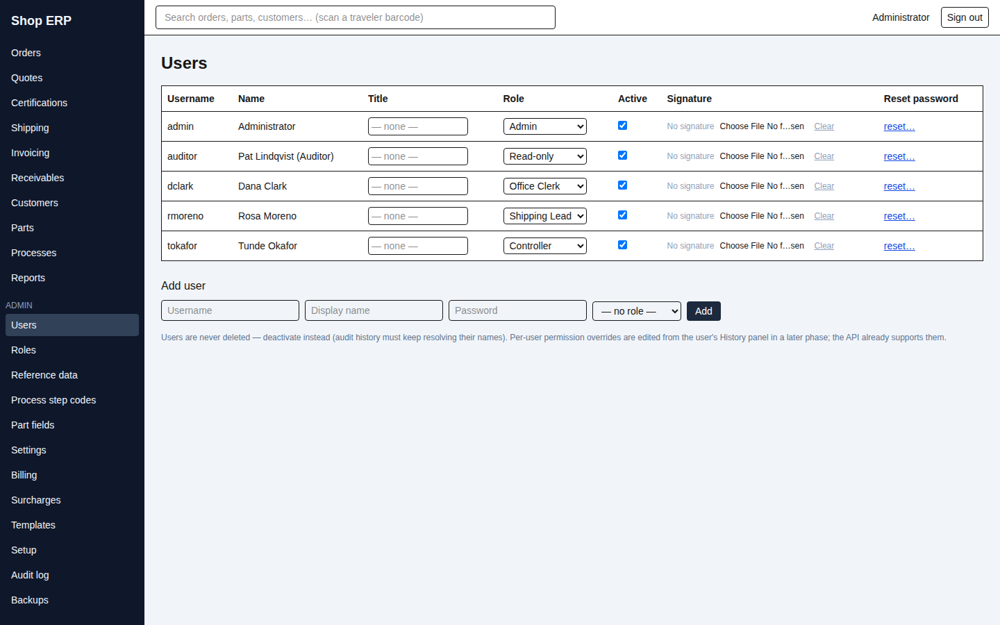

Columns are **Username**, **Name**, **Title**, **Role**, **Active**, **Signature** and **Reset
password**. Add somebody with the **Add user** form at the bottom: username, display name, password
and a role.

**Reset password** is the *reset…* link on their row; it asks for the new password (minimum eight
characters). There is no self-service reset anywhere in the system, so this is how a locked-out
colleague gets back in.

**Signature** holds a PNG or JPEG of the person's signature, used on printed documents. **Clear**
removes it.

> **Users are never deleted — deactivate them instead.** Untick **Active**. The account can no
> longer sign in, but every audit entry they ever created still resolves to their name. Deleting the
> row outright would leave years of history pointing at nobody, so the app does not offer it.

Everything on this screen is gated on the *manage users* action.

## Roles

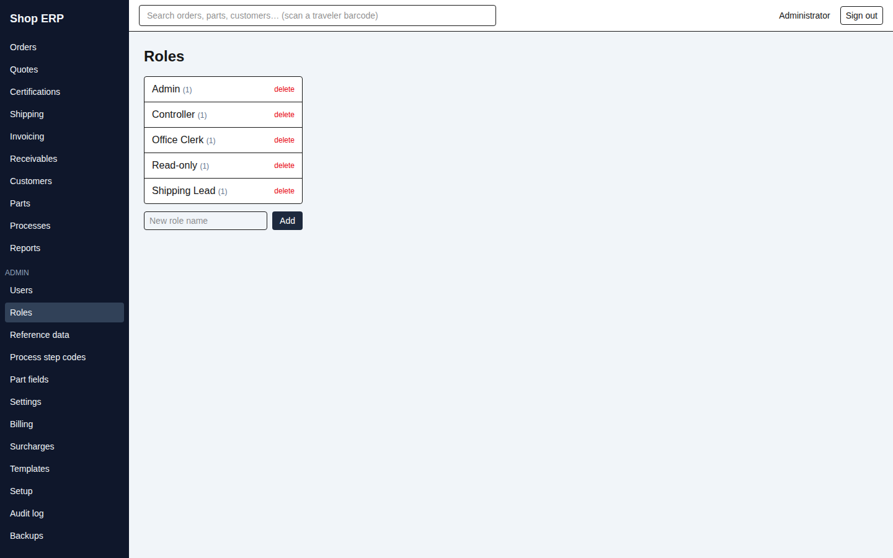

The left column lists the roles with the number of people holding each. Pick one and the right pane
shows its permission grid: a row per area, a tick per action, then a **Special actions** block
underneath with a checkbox for each of the thirteen named actions.

Build roles around jobs rather than seniority. The demonstration data does this deliberately —
Office Clerk holds no special actions at all, Shipping Lead holds the shop-floor ones and nothing
financial, Controller holds the money actions, Read-only holds view rights only.

**Deleting a role asks you why**, and stores the answer in the audit trail. It is the one place in
Administration that demands a reason, because a role deletion silently changes what a group of
people can do. A blank reason is refused.

## Reference data

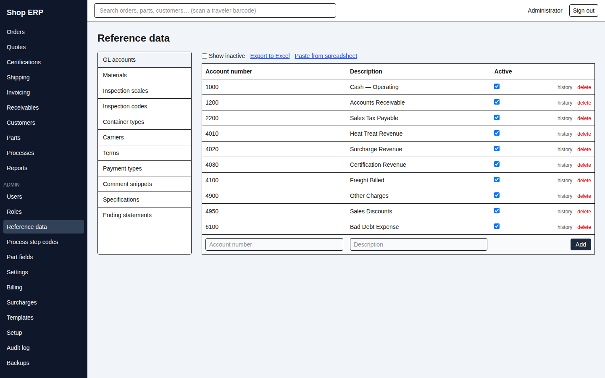

The shop's pick-lists — the values that appear in dropdowns everywhere else. Eleven kinds, chosen
from the list on the left:

| | | |
|---|---|---|
| GL accounts | Materials | Inspection scales |
| Inspection codes | Container types | Carriers |
| Terms | Payment types | Comment snippets |
| Specifications | Ending statements | |

Each has a table with **Active** and an add row. Some carry extra columns — Terms has **Net days**,
**Discount %** and **Discount days** (the early-pay terms in chapter 7); GL accounts have a
**Description**; Ending statements have **Text** and **Default**.

**Show inactive** reveals retired entries. **Export to Excel** exports the list. **Paste from
spreadsheet** opens a bulk-entry box for loading many rows at once — useful when first setting up.

> **A refused delete tells you what is in the way.** If a value is in use, the delete is refused and
> an amber panel lists the records using it, with **Export list to Excel** so you can work through
> them. This applies on reference data, part fields, step codes and surcharges alike. If you cannot
> clear the blockers, untick **Active** instead: the value stops being offered on new work while all
> the history that references it stays intact.

Every row has a **history** link showing who changed it and what the value was before.

## Process step codes

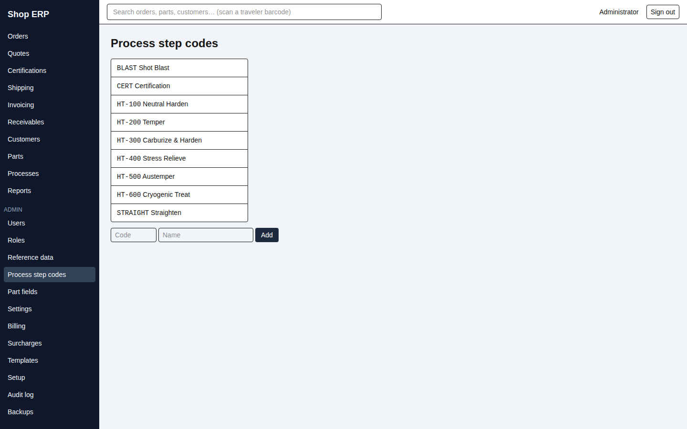

The operations a part can go through — the vocabulary the recipes in chapter 10 are written in.
Each code has a code, a name, an **Active** flag and a **GL account** (revenue for that operation
lands there; a code without one is badged **needs GL** and cannot be billed properly).

Below that is **Fields a step of this kind asks for** — the typed values an operator records when
running the step. Each field has a **Label**, a **Type** (NUMBER, TEXT, DATE or CHECKBOX) and an
optional **Unit**. The arrows reorder them, and **the order here is the order they are asked for on
the step and printed on the traveler.**

A code with no fields is text-only, which is right for something like a hot wash.

> **A field that has recorded values cannot be deleted or retyped.** The refusal names the field and
> how many values depend on it. And a step sitting on a locked recipe revision can never be released
> — that revision is frozen by design — so if a code is only used on superseded revisions, deleting
> it will never become possible. Set it Inactive instead.

## Part fields

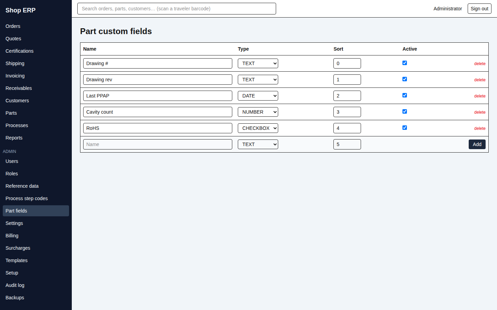

Extra fields you want to record on every part that the built-in ones do not cover. Each has a
**Name**, a **Type** (TEXT, NUMBER, DATE, CHECKBOX), a **Sort** position and **Active**. They then
appear on every part record (chapter 10).

The same rule applies: once values have been recorded, the field's type cannot change and it cannot
be deleted — the panel tells you how many parts are using it.

(The screen calls itself **Part custom fields** while the menu says **Part fields**. Same thing.)

## Settings

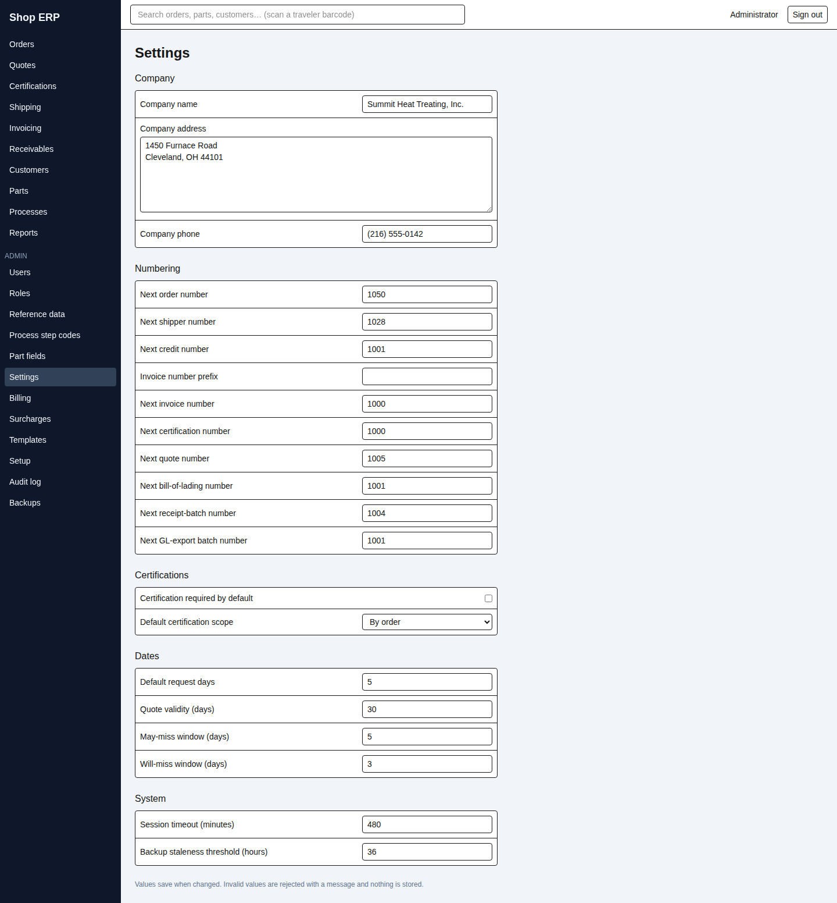

Plant-wide values, in five groups. **Values save as soon as you change them**; an invalid value is
rejected with a message and nothing is stored.

| Group | What is in it |
|---|---|
| **Company** | Company name, address and phone — the identity printed on every document |
| **Numbering** | The next number for orders, shippers, credits, quotes, bills of lading, receipt batches and GL export batches, plus an invoice number prefix |
| **Certifications** | Whether certification is required by default, and the default scope (**By order**, **By load** or **By shipment**) |
| **Dates** | Default request days, quote validity, and the two traffic-light windows — **May-miss** and **Will-miss** — that colour the dots on the orders board |
| **System** | Session timeout in minutes, and the backup staleness threshold in hours |

> **Set the numbering before you go live, and then leave it alone.** These are the starting points
> for the counters that issue document numbers. Moving one backwards after the shop is running
> invites a collision with paper a customer already holds.

> **Two number settings on this screen do nothing.** *Next invoice number* and *Next certification
> number* are still editable but drive nothing: an invoice is identified by its order number, and a
> certificate carries no number of its own (chapter 5). Changing them has no effect anywhere.

## Billing

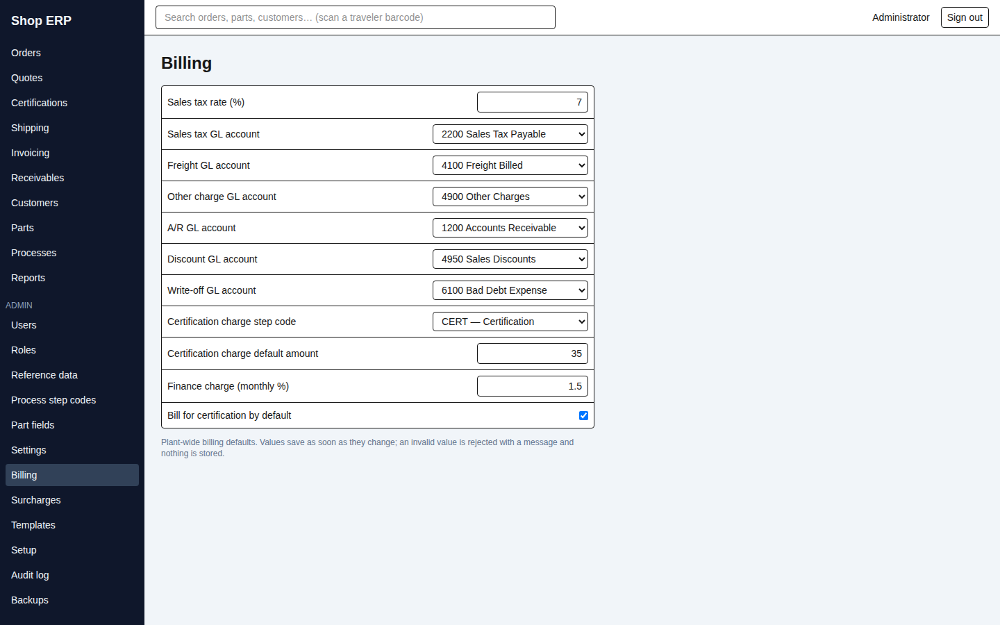

Where the money defaults live, and the GL accounts that invoice lines post to.

| Field | What it does |
|---|---|
| Sales tax rate (%) | The plant-wide rate, entered as a percent — 7 means 7%; a customer can be taxable or not (chapter 9) |
| Sales tax GL account | Where tax posts |
| Freight GL account | Where freight lines post |
| Other charge GL account | Where extra charges post |
| A/R GL account | The receivables control account |
| Discount GL account | Where early-pay discounts post |
| Write-off GL account | Where bad debt posts |
| Certification charge step code | The operation a cert charge bills under |
| Certification charge default amount | The default cert charge |
| Finance charge (monthly %) | The monthly late charge rate, as a percent — 1.5 means 1.5% per month |
| Bill for certification by default | Whether new work charges for certification |

These accounts are what makes the month-end GL export balance (chapter 8). **An invoice line whose
account is missing will block the export**, so it is worth completing this screen properly before
the first month end rather than discovering it during one.

## Surcharges

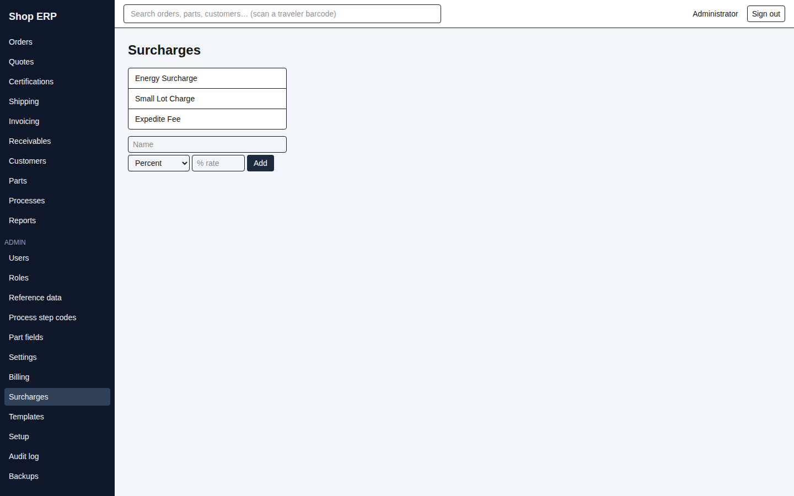

Standing extras added to invoices — an energy surcharge is the usual example.

Each surcharge has a **Name**, a **Kind** and a value. The Kind decides which value field you get:

- **Percent** → a **Rate (%)** field, applied to the operations in scope.
- **Flat amount** → an **Amount ($)** field.

Then **Minimum amount ($)**, a **Position** controlling the order they print in, a **GL account**
(one without is badged **needs GL**), **Active**, and a **Scope**:

| Scope | Meaning |
|---|---|
| All operations | Applies to everything |
| Only these operations | Applies to the step codes you tick |
| All except these | Applies to everything but the step codes you tick |

**Per-customer exceptions are not set here** — they live on the customer record (chapter 9), where a
customer can be given a reduced rate, a flat amount, or opted out entirely. The only place they
appear on this screen is when a delete is refused because customers hold overrides against it; the
panel then offers **Clear override** per customer so you can unpick them.

## Setup

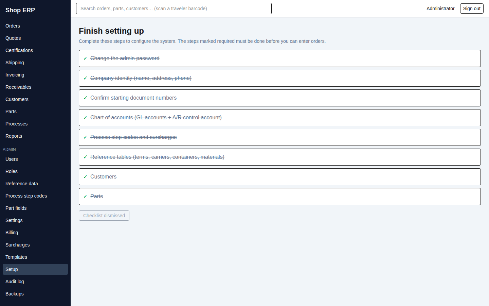

The first-run checklist. It lists the eight things a new installation needs configured, ticks each
one off as it becomes true, and strikes through the ones that are done.

Most of the list is checked by simply doing the work elsewhere in this chapter — the admin password,
company identity, the chart of accounts, step codes and surcharges, the reference tables, and your
first customers and parts. Two of them gate order entry: **you cannot enter an order until company
identity and a chart of accounts are configured**, and until then the New Order screen says so and
links here instead of showing the form.

**Confirm starting document numbers** is the one step with no other home. You set the numbers
themselves on the Settings page — where each series begins, so that the first order, invoice and
shipper carry on from whatever the shop used before rather than starting at 1 — but the **Confirm**
button that ticks the step off is on this screen and nowhere else.

While anything is outstanding, a banner sits across the top of every screen offering **Finish
setup**. **Dismiss** puts that banner away permanently — and that is why this page has its own entry
in the rail. Without one, dismissing the banner would leave the checklist, and the Confirm button
above with it, reachable only by typing the address.

## The audit log

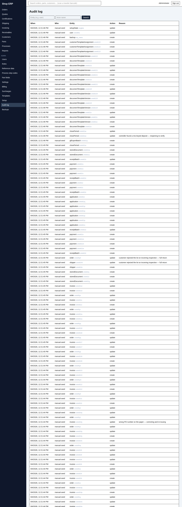

Every create, edit and delete in the system, by everybody, forever.

Filter by entity (for example `user`) and by actor name, then press **Search**. Columns are
**When**, **Who**, **Entity**, **Action** and **Reason** — the reason being the one typed at the
time for the acts that demand one.

> **This screen is the index, not the detail.** It tells you that a thing changed, who changed it
> and when. To see **what** changed — the before-and-after values, field by field — open the record
> itself and read its **History** panel. That is where a change reads as
> `status: ~~OPEN~~ → SHIPPED`, one line per altered field. Most detail screens in this manual have
> one, and the reference-data, step-code and surcharge screens carry a History panel per row.

Two practical limits worth knowing:

- **The list is capped at the 200 most recent matching entries**, newest first, and the screen does
  not tell you when you have hit the cap. Narrow the filters rather than scrolling.
- **The actor filter matches loosely; the entity filter must be exact.** Typing part of a name
  works; misspelling the entity returns nothing.

Nothing here can be edited or removed. That is the point of it.

## Backups

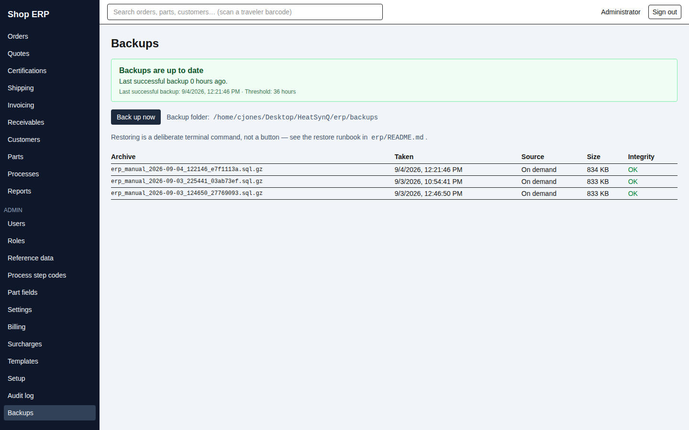

Available to holders of *manage backups*.

The panel at the top is the health indicator. It is green — **"Backups are up to date"** — only when
**all three** of these hold:

1. There is a backup archive newer than the staleness threshold (36 hours by default), **and** it
   passed its integrity check.
2. The last recorded run did not fail.
3. The status file is readable.

Anything else is red, with the reason spelled out in a sentence beneath: the last run failed, the
newest archive is past the threshold, no archive has ever been written, or the retention cleanup is
failing and old archives are piling up.

> **A missing status reads as overdue, and that is deliberate.** If the app can find no status file
> at all it goes red and says so: *"No readable backup status file was found in the backup folder. A
> missing status reads as overdue — the nightly backup container may never have started."* The
> failure mode this exists to catch is the silent one — a backup process that never ran at all
> produces no error, and a system that treated silence as success would show green for months and
> then lose everything. **Absence is failure here.** If the indicator is red and you cannot see why,
> that is still a real problem to chase, not a display glitch.

Beneath it: **Back up now** takes one on the spot, the backup folder path, and a note that
**restoring is a deliberate terminal command, not a button** — deliberately so, since restoring
overwrites the live database.

The table lists what is in the folder: **Archive**, **Taken**, **Source** (*Nightly* or *On
demand*), **Size** and **Integrity** (*OK* or *CORRUPT*). Nightly runs and on-demand ones never
collide.

**Archives are pruned after 30 days, on-demand ones included.** If you need to keep one longer — for
an audit, or before a big change — copy it out of the backup folder.

Anyone holding *manage backups* also sees a warning bar above every screen whenever backup health is
bad, so a failing backup follows you around the application until it is fixed.

Backups are **production-only**. On the practice copy the page refuses outright (chapter 14).

---

Next: [13. Document templates →](13-templates.md) · Previous: [11. Reports](11-reports.md)
