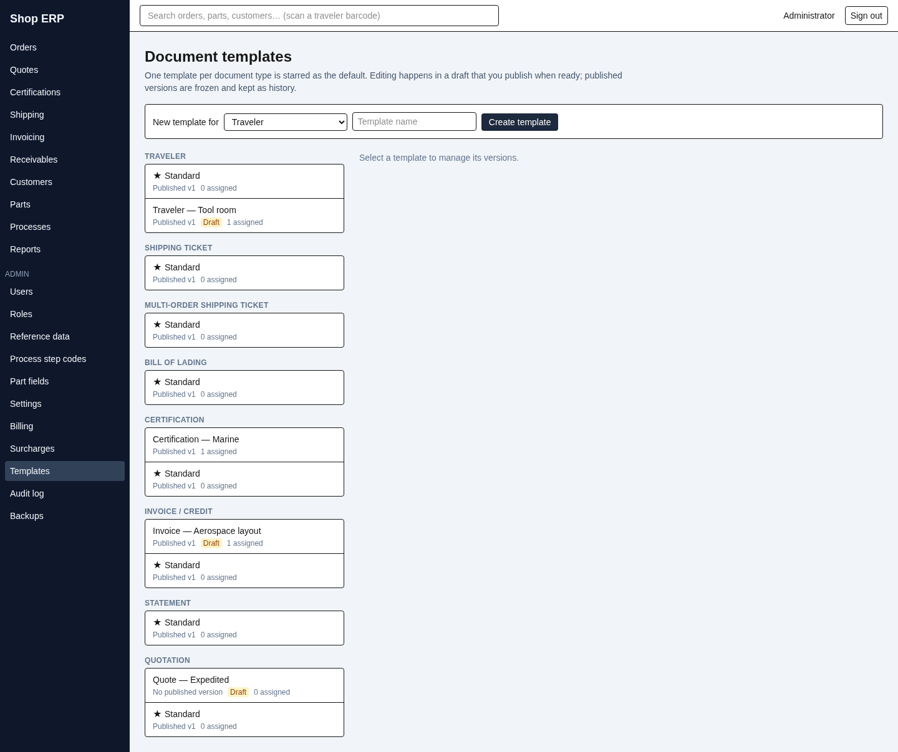
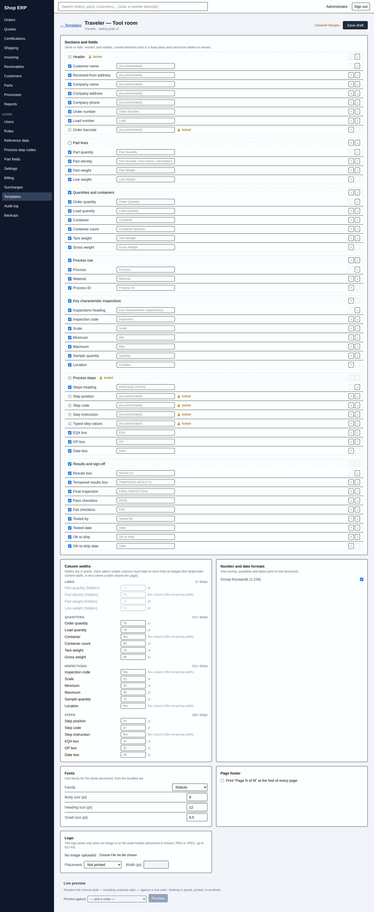

# 13. Document templates

[← Back to contents](README.md)

Every piece of paper this system produces is drawn from a **template** you control. If the traveler
needs the customer's name larger, if the invoice should carry your logo, if the bill of lading needs
different standing text — none of that is a change to the software. It is a change you make here.

## The eight document types

| Type | Where it comes from |
|---|---|
| Traveler | The order (chapter 2) |
| Shipping ticket | A shipment (chapter 4) |
| Multi-order shipping ticket | A shipment covering several orders |
| Bill of lading | A shipment |
| Certification | A certificate (chapter 5) |
| Invoice / credit | An invoice or credit memo (chapter 6) |
| Statement | A customer statement (chapter 7) |
| Quotation | A quote (chapter 3) |

Each type can have as many templates as you like — a plain one, one for a fussy aerospace customer,
one for the tool room. One per type is the **default**, marked with a star.

## The one rule worth learning first

**A template can re-arrange, re-label, restyle, show and hide. It can never add information the
system does not already collect.**

That sounds like a limitation and is actually the guarantee. A template chooses from the fields the
document already gathers, so it cannot invent a value, pull one from somewhere it should not, or
quietly change what a number means. Every rule elsewhere in this manual therefore still holds no
matter how the paper is laid out — a finalized invoice still prints the frozen figures it was raised
with, a shipping ticket still shows what was actually shipped.

If a document needs a piece of information it does not currently show, that is not a template job.

## The templates screen

Templates are grouped by document type. Each card shows:

| What you see | What it means |
|---|---|
| ★ before the name | This is the default for its type |
| **Published v1** | The version that prints today |
| **No published version** | Never published — cannot print, cannot be assigned |
| **Draft** (amber chip) | Somebody has an edit open |
| **N assigned** | How many customers are pointed at it specifically |

Create one with **New template for**, a type and a name, then **Create template**. Selecting a card
opens its detail pane on the right, where you can **Rename** it, manage its versions, or **Delete**
it.

**Deleting asks you why**, and says plainly what it does: the version history is retired from view
and the name can be reused later, starting a *fresh* template rather than restoring this one. A
template still assigned to customers cannot be deleted until those assignments are cleared — the
refusal lists which customers, so you know where to go.

## Drafts and publishing

This is the part that keeps old paper reproducible, so it is worth understanding properly.

**You never edit a live template.** You open a draft, change the draft, and publish it when you are
happy. The screen says so in a line: *"Editing happens in a draft that you publish when ready;
published versions are frozen and kept as history."*

The cycle:

1. **Open draft** — creates a new draft version copied from whatever is published now.
2. **Edit draft** — opens the editor. **Save draft** as often as you like; nothing prints yet.
3. **Publish** — the draft becomes the published version, and from that moment new documents use it.
   Or **Discard draft** and nothing changes.

**A published version is frozen forever.** It is never edited, never deleted, never renumbered.
Publishing a new version does not overwrite the old one — it adds a version and moves the pointer.
The **Version history** table lists them all with **Version**, **Status**, and when and by whom each
was **Published**. The one in force reads **PUBLISHED (current)**; earlier ones read **PUBLISHED**.

This is why paper stays honest: **every document the system stores records which template version
produced it.** Reprint an invoice from eight months ago and you get the exact bytes that printed
then, laid out the way your templates looked then — not the way they look today.

> **To go back to an earlier layout**, find it in the version history and press **Open draft from
> this version**. That copies the old version into a new draft you can publish. The old version is
> not "restored" or reactivated — you publish a new version that happens to match it, and the
> history keeps both. You can only have one draft open at a time.

**Set as default** makes a template the one used for its type when nothing more specific applies. A
template with nothing published cannot become the default — the button tells you so.

Publishing and setting a default both need the *edit templates* action on top of ordinary template
editing rights (chapter 12). Editing a draft is the everyday permission; changing what the shop
actually prints is the guarded one.

## The editor

The heading tells you exactly where you are — the template name, and beneath it the type and which
draft version you are editing. **Unsaved changes** appears the moment you touch anything; **Save
draft** puts it away.

The editor is a stack of panels. Which ones appear depends on the document — a traveler has no
standing text, an invoice has no barcode.

**Sections and fields** — the main one. *"Show or hide, reorder, and relabel."* Every section and
every field within it has a tick box (show it or not), a text box to override its printed label, and
arrows to move it. Clear a label box and it goes back to the built-in wording.

**Column widths** — for the tables on the document, measured in points. Each table shows a running
total against its budget, because a page is only so wide: *"the 564pt letter content width, or less
where a table shares the page."* Go over and the editor refuses to save until you narrow or hide a
column. A column can be set to **flex**, which fills whatever width is left.

**Number and date formats** — how money, quantities and dates print: negative amounts (sign after
the symbol, leading minus, or parentheses), decimal places, thousands separators, and the date
format.

**Fonts** — one family for the whole document, from a bundled set, plus body, heading and small
sizes. You cannot upload a font.

**Standing text** — the paragraphs printed verbatim on every document of that type: the cert
statement, the shipping liability text, the quote intro. The bill of lading has eleven of them,
which is the nature of a bill of lading. **This is where that wording is edited** — it used to be a
system-wide setting and is now part of each template, so two templates can carry different terms.

**Page footer** — whether to print "Page N of M" at the foot of every page.

**Logo** — upload a PNG or JPEG up to 512 KB, choose a **Placement** (header left, centre or right,
or *Not printed*) and a width. It prints only when both an image and a placement are set.

**Live preview** — the panel at the bottom, and the one to use before publishing. Pick a real
record and press **Preview**: it renders the draft you are looking at, *including edits you have not
saved*, against genuine data. *"Nothing is saved, printed, or archived."* No number is allocated, no
document is stored, nothing is marked as printed. Preview freely.

> **If two people edit the same draft**, the second save is refused rather than silently overwriting
> the first. The editor reloads the current draft, sets your edits aside, and offers **Re-apply my
> changes**. Nobody's work is lost, but somebody has to decide.

## Locked elements

A few things cannot be hidden, and the editor marks them with a **padlock** and the word *locked*.
Hover it and it tells you why.

**All of them are on the traveler**; every other document type is entirely free.

| Locked | Why |
|---|---|
| The **Order barcode** (and so the Header section that contains it) | The barcode is automatic — scanning it opens the order. A traveler without it breaks the scanning workflow the shop runs on. |
| The **Process steps** section, and within it **Step position**, **Step code**, **Step instruction** and **Typed step values** | The typed step fields print in a fixed place and cannot be quietly omitted. These are the operator's instructions and the values recorded against them. |

The reasoning is the same in both cases: these are not decoration, and a traveler that lost them
would look fine and be wrong. So the app refuses in three separate places — the editor disables the
control, the validator refuses a configuration that hides them, and the document builder prints them
even if a configuration somehow got past both.

Two details that catch people out:

- **The Process steps section is also pinned** — it cannot be moved, not just not hidden.
- **The Header section shows a padlock but can still be reordered.** Only *hiding* it is refused.
  You can move it; you cannot lose it.

Everything else inside those sections is yours: the steps heading, the EQ#, OP and Date handwriting
boxes are all ordinary fields you can hide or relabel.

## Assigning a template to a customer

Most shops need one exception before they need two. Rather than switching the default back and
forth, point the individual customer at the template they need.

On the customer's page there is a **Document templates** section with a row per document type. Set
one and that customer's paper uses it. The first option in every dropdown is **Use default /
inherit**, which is how you take an exception back off again.

Each row tells you, in words, what will actually print:

| The row says | Meaning |
|---|---|
| **Assigned: Invoice — Aerospace layout** | This customer has been pointed at that template directly |
| **Inherited from AERO — Aerospace Dynamics Corp: …** | Nothing is set here; the parent customer's choice applies |
| **Bill of lading default (Standard)** | Nothing is set anywhere up the chain; the type's default applies |

That is the whole resolution rule, and it runs in that order: **the customer's own choice, then the
nearest parent division that has one, then the type's default.** Divisions (chapter 9) inherit from
their parent unless given their own, so setting a template once on the parent covers every division
beneath it.

A template that has never been published appears in the list but cannot be chosen — it is greyed
out, with a tooltip saying to publish a version first. Nothing unpublished can ever reach a
customer's paper.

Changing an assignment needs both customer-editing rights and the *edit templates* action.

---

Next: [14. The practice copy →](14-practice-copy.md) · Previous: [12. Administration](12-administration.md)
