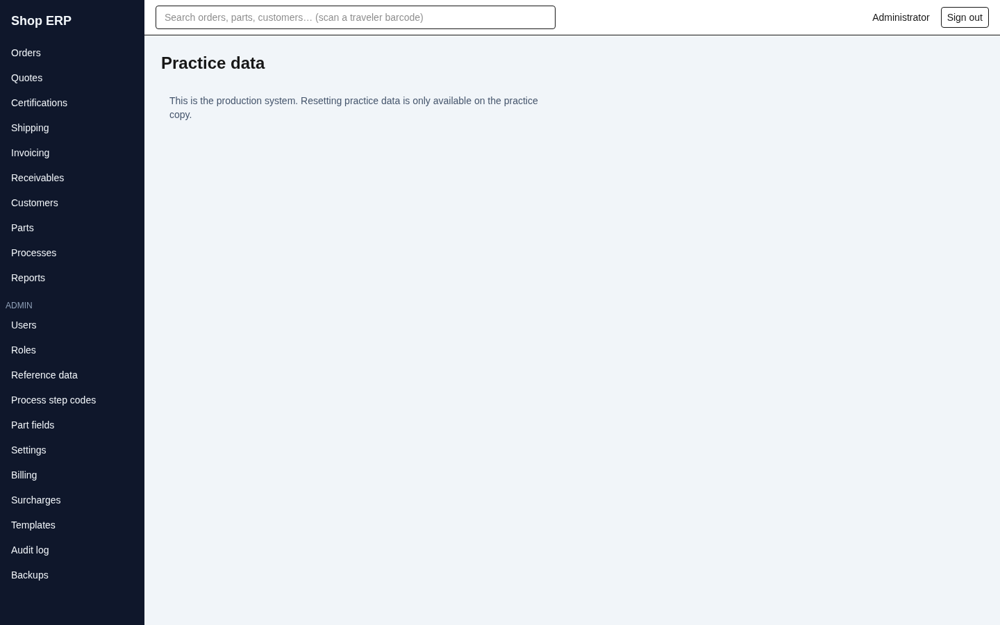

# 14. The practice copy

[← Back to contents](README.md)

New staff need somewhere to make mistakes. The practice copy is that place: a complete, working
copy of the application, loaded with sample data, where every button does exactly what it does on
the real system — and none of it touches the shop's books.

## It is a separate copy, not a setting

This is the most important thing to understand, and it is deliberate.

**There is no switch inside the real system.** You cannot put the live application into practice
mode, and nobody can do it by accident. The practice copy is a **second copy of the whole
application, running against its own separate database**, started by whoever administers the
server. The two share nothing: not orders, not customers, not invoices, not users.

That means:

| | Real system | Practice copy |
|---|---|---|
| Its own database | yes | yes — a different one |
| Its own address | the address the office gives you | a different address on the same server |
| Its own user accounts | yes | yes — separate logins |
| Documents it prints | real paper | watermarked |
| Backed up nightly | yes | **no — deliberately** |

Because the two are separate addresses with separate sign-ins, **signing into the practice copy
does not sign you out of the real one.** You can have both open side by side, which is exactly how
you want to train somebody.

> **How the app decides.** The application asks the database what its own name is, and that answer
> is final. A configuration setting can *agree* with it but can never override it. If someone
> configures a server as "practice" while it is in fact pointed at the real database, the
> application **refuses to run at all** rather than quietly present the shop's live books as a
> training copy. This is the one place the system prefers to stop dead over guessing.

## How you know which one you are in

Two signals, and you cannot miss either.

**A banner on every screen.** The practice copy shows an amber bar across the top of every page,
including the sign-in screen:

> PRACTICE MODE — sample data for training. Documents are watermarked; nothing here affects
> production. **Reset practice data**

It sits above everything else on the page, so it is there even before you have signed in — which is
the moment a trainer most needs to see it.

**A watermark on every document.** Every PDF the practice copy produces — traveler, shipper,
BOL, certificate, invoice, statement, quote — carries **PRACTICE / SAMPLE** printed diagonally
across each page in red. A practice traveler cannot be mistaken for a real one on the shop floor,
and a practice invoice cannot be mistaken for real paper on somebody's desk.

The real system has neither the banner nor the watermark. **If you see no amber bar, you are in the
live system — type carefully.**

## Using it for training

Everything behaves as it really behaves. Orders allocate real order numbers, shipments allocate
shipper and BOL numbers, invoices finalize and lock, months close. The guards are the same guards:
a closed month still refuses a posting, a finalized invoice still refuses an edit, a voided order is
still read-only. That is the point — training against a softened copy teaches habits that fail on
the first real day.

Good things to practise here: entering an order end to end, taking a shipment back out with a
reversal, unlocking and re-finalizing an invoice, applying a payment with an early-pay discount,
and closing a month. All of them are easier to understand once you have broken them a few times.

## Resetting it

Training data gets messy, and it is meant to. **Reset** puts the practice copy back to the sample
data it shipped with.

**The Practice data screen has no menu entry** — you reach it from the **Reset practice data** link
at the end of the amber banner, which is on every screen anyway. Once there, press **Reset practice
data**.

The screen above is the **production** view: on the real system the page exists but offers no
control at all, only the note *"This is the production system. Resetting practice data is only
available on the practice copy."* On the practice copy, the same page instead shows an amber panel
and the red **Reset practice data** button.

Pressing it asks you to confirm:

> Reset ALL practice data to the demo baseline? Everything entered in the practice copy is
> permanently erased and replaced with the sample data.

Take that sentence literally. Unlike everywhere else in this system, **a reset is not a soft
delete** — it is not hidden, not recoverable, and not in the audit log afterwards, because the
history is erased along with everything else. A reset is a *reset*, not a correction. Anything a
trainee wanted to keep should have been written down first.

That single **OK** is the only safeguard: there is no phrase to type and no reason to give. It is
one click and one confirmation, so read the dialog before you press it.

What happens next:

1. Everything in the practice database is cleared.
2. The sample customers, parts, orders, templates and settings are put back.
3. **You are signed out**, because your account was cleared too. The screen tells you so:
   *"Practice data was reset. Signing you out — sign back in with admin / admin."*
4. Sign back in as `admin` / `admin` and carry on.

Resetting needs the same permission as other administrative edits. Without it the button is
visible but greyed out, with the usual reason in its tooltip.

If a reset fails part way through, simply run it again. It is not one single all-or-nothing
operation, so an interrupted reset can leave the copy half-populated — running it a second time
puts it right.

## What the practice copy deliberately will not do

**It is not backed up, and it will not let you back it up.** The Backups page and **Back up now**
refuse on the practice copy outright:

> Backups are managed on the production copy only — the practice database is not backed up.

This is not an oversight. The practice copy's data is disposable by design — the reset throws it
away on purpose — so it has no backup responsibility. More to the point, a trainee pressing "Back
up now" must never land an archive in the real system's backup folder, nor reset the real system's
"last backup" clock. Backups belong to production, and only to production (chapter 12).

**And a reset can never reach the real system.** Even if the practice screen were somehow opened
against production, the request is checked a second time on the server, against the database's own
identity, at the moment it runs — and refused. The button being hidden is the courtesy; the refusal
is the guarantee.

---

Previous: [13. Document templates](13-templates.md) · [← Back to contents](README.md)
